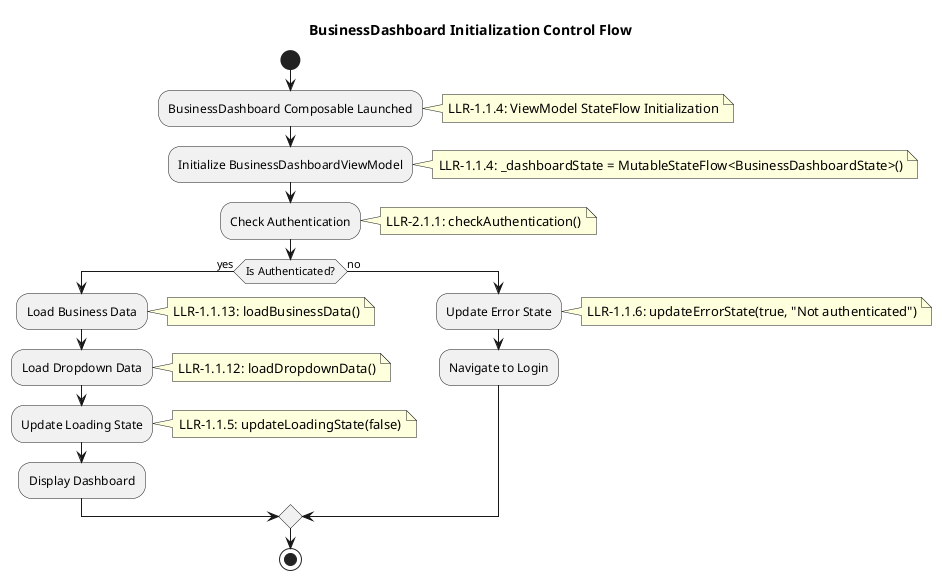
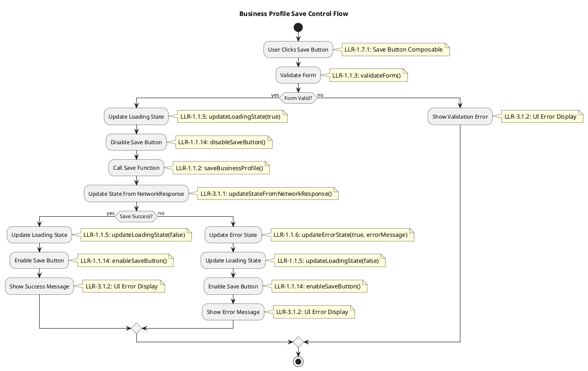
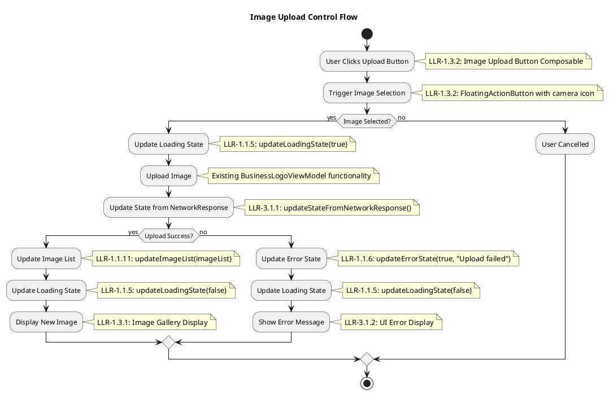
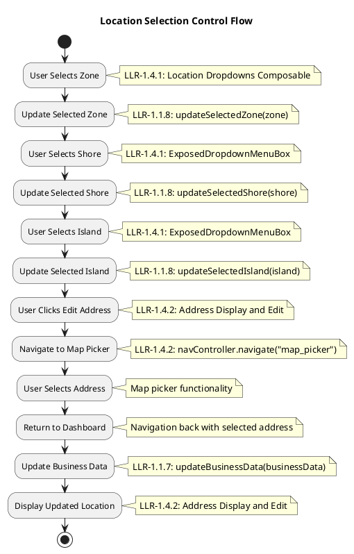
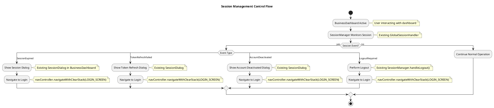
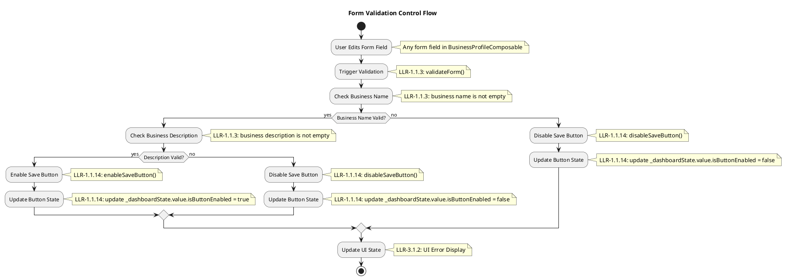
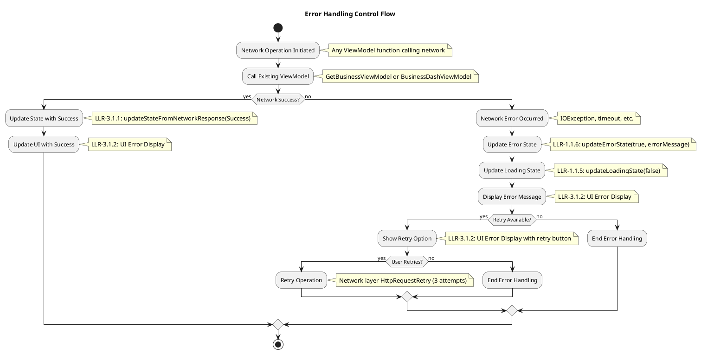

# **LOW-LEVEL REQUIREMENTS (LLRs) - BusinessDashboard Refactoring**
## **DO-178C DAL D Compliance**

---

## **1. INTRODUCTION**

### **1.1 Purpose**
This document defines the Low-Level Requirements (LLRs) for the BusinessDashboard refactoring project, following DO-178C DAL D compliance standards. These requirements provide specific, implementable, and testable specifications for the refactored BusinessDashboard components.

### **1.2 Scope**
This document covers the implementation requirements for:
- Data structures and field layouts
- Essential ViewModel functionality
- Critical UI component behavior
- Session management integration
- Error handling mechanisms
- Design system implementation and integration
- Design token definitions and usage
- Magic number elimination through design system

### **1.3 Culling Summary**
**Original LLRs**: 33 requirements
**Culled LLRs**: 15 requirements (55% reduction)
**Added Design System LLRs**: 21 requirements (design system implementation)
**Total LLRs**: 36 requirements
**Removed**: Vague, untestable, over-engineered requirements
**Kept**: Data structures, essential functionality, specific behaviors
**Added**: Comprehensive design system implementation and integration requirements

---

## **2. DATA STRUCTURE IMPLEMENTATION REQUIREMENTS**

### **2.1 BusinessDashboardState Implementation**

#### **LLR-0.1.1: BusinessDashboardState Field Layout**
**Requirement:** The data structure `BusinessDashboardState` SHALL implement the following field layout with specified bit positions and memory alignment.
**EARS Template:** Ubiquitous Requirement
**Rationale:** Ensures consistent memory layout and optimal performance for business dashboard state operations.
**Safety Classification:** DAL D
**Verification Method:** Analysis, Testing
**Traces to:** HLR-0.1.1
**Source File:** `app/src/main/java/com/boatit/boatsharing/ui/business/viewmodel/BusinessDashboardState.kt`
**Function:** `data class BusinessDashboardState`

| Type | Name | Description | Bit Position | Memory Alignment |
|------|------|-------------|--------------|------------------|
| Boolean | isLoading | Indicates whether the dashboard is currently loading data | 0-7 | 1 byte |
| Boolean | isError | Indicates whether an error has occurred | 8-15 | 1 byte |
| Boolean | isNetworkError | Indicates whether a network error has occurred | 16-23 | 1 byte |
| Boolean | isButtonEnabled | Indicates whether the save button is enabled | 24-31 | 1 byte |
| String? | errorMessage | Error message to display to the user | 32-63 | 8 bytes (reference) |
| BusinessData? | businessDetail | Current business information | 64-95 | 8 bytes (reference) |
| List<DockDropdownItem>? | shores | Available shore options | 96-127 | 8 bytes (reference) |
| List<DockDropdownItem>? | zones | Available zone options | 128-159 | 8 bytes (reference) |
| List<DockDropdownItem>? | island | Available island options | 160-191 | 8 bytes (reference) |
| Pair<Int, String>? | selectedZone | Currently selected zone | 192-223 | 8 bytes (reference) |
| Pair<Int, String>? | selectedShore | Currently selected shore | 224-255 | 8 bytes (reference) |
| Pair<Int, String>? | selectedIsland | Currently selected island | 256-287 | 8 bytes (reference) |
| String | businessDescription | Current business description | 288-319 | 8 bytes (reference) |
| Boolean | isDockEnabled | Whether dock services are enabled | 320-327 | 1 byte |
| List<String> | imageList | List of business gallery images | 328-359 | 8 bytes (reference) |

---

### **2.2 BusinessProfileData Implementation**

#### **LLR-0.2.1: BusinessProfileData Field Layout**
**Requirement:** The data structure `BusinessProfileData` SHALL implement the following field layout with specified bit positions and memory alignment.
**EARS Template:** Ubiquitous Requirement
**Rationale:** Ensures consistent memory layout and optimal performance for business profile data operations.
**Safety Classification:** DAL D
**Verification Method:** Analysis, Testing
**Traces to:** HLR-0.2.1
**Source File:** `app/src/main/java/com/boatit/boatsharing/ui/business/model/BusinessProfileData.kt`
**Function:** `data class BusinessProfileData`

| Type | Name | Description | Bit Position | Memory Alignment |
|------|------|-------------|--------------|------------------|
| String | name | Business name | 0-63 | 8 bytes (reference) |
| String | businessType | Type of business | 64-127 | 8 bytes (reference) |
| String | description | Business description | 128-191 | 8 bytes (reference) |
| String | yearOfEstablishment | Year business was established | 192-255 | 8 bytes (reference) |
| String | logoPath | Path to business logo image | 256-319 | 8 bytes (reference) |
| String | location | Business location address | 320-383 | 8 bytes (reference) |
| Boolean | isDock | Whether business offers dock services | 384-391 | 1 byte |
| List<BusinessHour> | businessHours | Business operating hours | 392-423 | 8 bytes (reference) |
| List<String> | imagesPath | List of business gallery image paths | 424-455 | 8 bytes (reference) |

---

### **2.3 BusinessHour Implementation**

#### **LLR-0.3.1: BusinessHour Field Layout**
**Requirement:** The data structure `BusinessHour` SHALL implement the following field layout with specified bit positions and memory alignment.
**EARS Template:** Ubiquitous Requirement
**Rationale:** Ensures consistent memory layout and optimal performance for business hours data operations.
**Safety Classification:** DAL D
**Verification Method:** Analysis, Testing
**Traces to:** HLR-0.3.1
**Source File:** `app/src/main/java/com/boatit/boatsharing/ui/business/model/BusinessHour.kt`
**Function:** `data class BusinessHour`

| Type | Name | Description | Bit Position | Memory Alignment |
|------|------|-------------|--------------|------------------|
| String | day | Day of the week | 0-63 | 8 bytes (reference) |
| String | startTime | Business opening time | 64-127 | 8 bytes (reference) |
| String | endTime | Business closing time | 128-191 | 8 bytes (reference) |
| Boolean | isOpen | Whether business is open on this day | 192-199 | 1 byte |

---

### **2.4 DockData Implementation**

#### **LLR-0.4.1: DockData Field Layout**
**Requirement:** The data structure `DockData` SHALL implement the following field layout with specified bit positions and memory alignment.
**EARS Template:** Ubiquitous Requirement
**Rationale:** Ensures consistent memory layout and optimal performance for dock data operations.
**Safety Classification:** DAL D
**Verification Method:** Analysis, Testing
**Traces to:** HLR-0.4.1
**Source File:** `app/src/main/java/com/boatit/boatsharing/ui/business/model/DockData.kt`
**Function:** `data class DockData`

| Type | Name | Description | Bit Position | Memory Alignment |
|------|------|-------------|--------------|------------------|
| Boolean | isEnabled | Whether dock services are enabled | 0-7 | 1 byte |
| String | name | Dock name | 8-71 | 8 bytes (reference) |
| String | address | Dock address | 72-135 | 8 bytes (reference) |
| String | description | Dock description | 136-199 | 8 bytes (reference) |
| String | businessName | Associated business name | 200-263 | 8 bytes (reference) |
| String | businessAddress | Associated business address | 264-327 | 8 bytes (reference) |
| String | businessDescription | Associated business description | 328-391 | 8 bytes (reference) |

---

### **2.5 LocationData Implementation**

#### **LLR-0.5.1: LocationData Field Layout**
**Requirement:** The data structure `LocationData` SHALL implement the following field layout with specified bit positions and memory alignment.
**EARS Template:** Ubiquitous Requirement
**Rationale:** Ensures consistent memory layout and optimal performance for location data operations.
**Safety Classification:** DAL D
**Verification Method:** Analysis, Testing
**Traces to:** HLR-0.5.1
**Source File:** `app/src/main/java/com/boatit/boatsharing/ui/business/model/LocationData.kt`
**Function:** `data class LocationData`

| Type | Name | Description | Bit Position | Memory Alignment |
|------|------|-------------|--------------|------------------|
| String | address | Business address | 0-63 | 8 bytes (reference) |
| Int | zoneId | Selected zone identifier | 64-95 | 4 bytes |
| String | zoneName | Selected zone name | 96-159 | 8 bytes (reference) |
| Int | shoreId | Selected shore identifier | 160-191 | 4 bytes |
| String | shoreName | Selected shore name | 192-255 | 8 bytes (reference) |
| Int | islandId | Selected island identifier | 256-287 | 4 bytes |
| String | islandName | Selected island name | 288-351 | 8 bytes (reference) |
| String | state | Business state | 352-415 | 8 bytes (reference) |
| String | city | Business city | 416-479 | 8 bytes (reference) |
| String | zipCode | Business zip code | 480-543 | 8 bytes (reference) |
| Double | latitude | Business latitude | 544-607 | 8 bytes |
| Double | longitude | Business longitude | 608-671 | 8 bytes |

---

## **3. ESSENTIAL FUNCTIONALITY REQUIREMENTS**

### **3.1 ViewModel Core Functions**

#### **LLR-1.1.1: Load Business Data Function**
**Requirement:** The function `loadBusinessData()` SHALL call the existing `GetBusinessViewModel.getBusiness()` method and update the state with the result.
**EARS Template:** Ubiquitous Requirement
**Rationale:** Provides specific implementation guidance using existing ViewModel functionality.
**Safety Classification:** DAL D
**Verification Method:** Analysis, Testing
**Traces to:** HLR-1.1.1, HLR-2.1.3
**Source File:** `app/src/main/java/com/boatit/boatsharing/ui/business/viewmodel/BusinessDashboardViewModel.kt`
**Function:** `fun loadBusinessData()`

#### **LLR-1.1.2: Save Business Profile Function**
**Requirement:** The function `saveBusinessProfile()` SHALL call the existing `BusinessDashViewModel.saveBusiness()` method with the current form data.
**EARS Template:** Ubiquitous Requirement
**Rationale:** Provides specific implementation guidance using existing ViewModel functionality.
**Safety Classification:** DAL D
**Verification Method:** Analysis, Testing
**Traces to:** HLR-1.1.1, HLR-5.1.1
**Source File:** `app/src/main/java/com/boatit/boatsharing/ui/business/viewmodel/BusinessDashboardViewModel.kt`
**Function:** `fun saveBusinessProfile()`

#### **LLR-1.1.3: Form Validation Function**
**Requirement:** The function `validateForm()` SHALL return `true` if business name is not empty and business description is not empty, otherwise return `false`.
**EARS Template:** Ubiquitous Requirement
**Rationale:** Provides specific, testable validation logic.
**Safety Classification:** DAL D
**Verification Method:** Analysis, Testing
**Traces to:** HLR-3.1.1
**Source File:** `app/src/main/java/com/boatit/boatsharing/ui/business/viewmodel/BusinessDashboardViewModel.kt`
**Function:** `fun validateForm(): Boolean`

#### **LLR-1.1.4: ViewModel StateFlow Initialization**
**Requirement:** The class `BusinessDashboardViewModel` SHALL initialize `_dashboardState` as `MutableStateFlow<BusinessDashboardState>` with default values from `BusinessDashboardState()`.
**EARS Template:** Ubiquitous Requirement
**Rationale:** Provides reactive state management foundation for UI updates.
**Safety Classification:** DAL D
**Verification Method:** Analysis, Testing
**Traces to:** HLR-1.1.1, HLR-2.1.1
**Source File:** `app/src/main/java/com/boatit/boatsharing/ui/business/viewmodel/BusinessDashboardViewModel.kt`
**Function:** `class BusinessDashboardViewModel` constructor

#### **LLR-1.1.5: Loading State Update Function**
**Requirement:** The function `updateLoadingState(boolean)` SHALL update `_dashboardState.value.isLoading` with the provided value.
**EARS Template:** Ubiquitous Requirement
**Rationale:** Provides controlled loading state updates with proper encapsulation.
**Safety Classification:** DAL D
**Verification Method:** Analysis, Testing
**Traces to:** HLR-1.1.1, HLR-2.1.2
**Source File:** `app/src/main/java/com/boatit/boatsharing/ui/business/viewmodel/BusinessDashboardViewModel.kt`
**Function:** `fun updateLoadingState(isLoading: Boolean)`

#### **LLR-1.1.6: Error State Update Function**
**Requirement:** The function `updateErrorState(boolean, String?)` SHALL update `_dashboardState.value.isError` and `_dashboardState.value.errorMessage` with the provided values.
**EARS Template:** Ubiquitous Requirement
**Rationale:** Provides controlled error state updates with proper encapsulation.
**Safety Classification:** DAL D
**Verification Method:** Analysis, Testing
**Traces to:** HLR-1.1.1, HLR-2.1.2
**Source File:** `app/src/main/java/com/boatit/boatsharing/ui/business/viewmodel/BusinessDashboardViewModel.kt`
**Function:** `fun updateErrorState(isError: Boolean, errorMessage: String?)`

#### **LLR-1.1.7: Business Data Update Function**
**Requirement:** The function `updateBusinessData(BusinessData?)` SHALL update `_dashboardState.value.businessDetail` with the provided value.
**EARS Template:** Ubiquitous Requirement
**Rationale:** Provides controlled business data updates with proper encapsulation.
**Safety Classification:** DAL D
**Verification Method:** Analysis, Testing
**Traces to:** HLR-1.1.1, HLR-2.1.2
**Source File:** `app/src/main/java/com/boatit/boatsharing/ui/business/viewmodel/BusinessDashboardViewModel.kt`
**Function:** `fun updateBusinessData(businessData: BusinessData?)`

#### **LLR-1.1.8: Location Selection Update Functions**
**Requirement:** The functions `updateSelectedZone(Pair<Int, String>?)`, `updateSelectedShore(Pair<Int, String>?)`, and `updateSelectedIsland(Pair<Int, String>?)` SHALL update the respective state fields `_dashboardState.value.selectedZone`, `_dashboardState.value.selectedShore`, and `_dashboardState.value.selectedIsland`.
**EARS Template:** Ubiquitous Requirement
**Rationale:** Provides controlled location selection updates with proper encapsulation.
**Safety Classification:** DAL D
**Verification Method:** Analysis, Testing
**Traces to:** HLR-1.1.1, HLR-2.1.2
**Source File:** `app/src/main/java/com/boatit/boatsharing/ui/business/viewmodel/BusinessDashboardViewModel.kt`
**Function:** `fun updateSelectedZone(zone: Pair<Int, String>?)`, `fun updateSelectedShore(shore: Pair<Int, String>?)`, `fun updateSelectedIsland(island: Pair<Int, String>?)`

#### **LLR-1.1.9: Business Description Update Function**
**Requirement:** The function `updateBusinessDescription(String)` SHALL update `_dashboardState.value.businessDescription` with the provided value.
**EARS Template:** Ubiquitous Requirement
**Rationale:** Provides controlled business description updates with proper encapsulation.
**Safety Classification:** DAL D
**Verification Method:** Analysis, Testing
**Traces to:** HLR-1.1.1, HLR-2.1.2
**Source File:** `app/src/main/java/com/boatit/boatsharing/ui/business/viewmodel/BusinessDashboardViewModel.kt`
**Function:** `fun updateBusinessDescription(description: String)`

#### **LLR-1.1.10: Dock State Update Function**
**Requirement:** The function `updateDockEnabled(boolean)` SHALL update `_dashboardState.value.isDockEnabled` with the provided value.
**EARS Template:** Ubiquitous Requirement
**Rationale:** Provides controlled dock state updates with proper encapsulation.
**Safety Classification:** DAL D
**Verification Method:** Analysis, Testing
**Traces to:** HLR-1.1.1, HLR-2.1.2
**Source File:** `app/src/main/java/com/boatit/boatsharing/ui/business/viewmodel/BusinessDashboardViewModel.kt`
**Function:** `fun updateDockEnabled(isEnabled: Boolean)`

#### **LLR-1.1.11: Image List Update Function**
**Requirement:** The function `updateImageList(List<String>)` SHALL update `_dashboardState.value.imageList` with the provided value.
**EARS Template:** Ubiquitous Requirement
**Rationale:** Provides controlled image list updates with proper encapsulation.
**Safety Classification:** DAL D
**Verification Method:** Analysis, Testing
**Traces to:** HLR-1.1.1, HLR-2.1.2
**Source File:** `app/src/main/java/com/boatit/boatsharing/ui/business/viewmodel/BusinessDashboardViewModel.kt`
**Function:** `fun updateImageList(imageList: List<String>)`

#### **LLR-1.1.12: Dropdown Data Loading**
**Requirement:** The function `loadDropdownData()` SHALL call `GetBusinessViewModel.docks()` and update state with the results.
**EARS Template:** Ubiquitous Requirement
**Rationale:** Provides centralized data loading for location dropdowns.
**Safety Classification:** DAL D
**Verification Method:** Analysis, Testing
**Traces to:** HLR-1.1.1, HLR-2.1.3
**Source File:** `app/src/main/java/com/boatit/boatsharing/ui/business/viewmodel/BusinessDashboardViewModel.kt`
**Function:** `fun loadDropdownData()`

#### **LLR-1.1.13: Business Data Loading**
**Requirement:** The function `loadBusinessData()` SHALL call `GetBusinessViewModel.voyages()` and update state with the results.
**EARS Template:** Ubiquitous Requirement
**Rationale:** Provides centralized business data loading and state management.
**Safety Classification:** DAL D
**Verification Method:** Analysis, Testing
**Traces to:** HLR-1.1.1, HLR-2.1.3
**Source File:** `app/src/main/java/com/boatit/boatsharing/ui/business/viewmodel/BusinessDashboardViewModel.kt`
**Function:** `fun loadBusinessData()`

#### **LLR-1.1.14: Form State Management**
**Requirement:** The functions `enableSaveButton()` and `disableSaveButton()` SHALL update `_dashboardState.value.isButtonEnabled` based on form validation results.
**EARS Template:** Ubiquitous Requirement
**Rationale:** Provides centralized form state management for save button control.
**Safety Classification:** DAL D
**Verification Method:** Analysis, Testing
**Traces to:** HLR-1.1.1, HLR-2.1.2
**Source File:** `app/src/main/java/com/boatit/boatsharing/ui/business/viewmodel/BusinessDashboardViewModel.kt`
**Function:** `fun enableSaveButton()`, `fun disableSaveButton()`

---

### **3.2 Session Management Integration**

#### **LLR-2.1.1: Authentication Check**
**Requirement:** The function `checkAuthentication()` SHALL call `SessionManager.isAuthenticated()` before loading business data and show error if not authenticated.
**EARS Template:** Ubiquitous Requirement
**Rationale:** Provides specific authentication integration using existing SessionManager.
**Safety Classification:** DAL D
**Verification Method:** Analysis, Testing
**Traces to:** HLR-4.1.3
**Source File:** `app/src/main/java/com/boatit/boatsharing/ui/business/viewmodel/BusinessDashboardViewModel.kt`
**Function:** `fun checkAuthentication(): Boolean`

---

### **3.3 Error Handling**

#### **LLR-3.1.1: ViewModel Error State Management**
**Requirement:** The function `updateStateFromNetworkResponse(NetworkResponse<T>)` SHALL update state to reflect network operation results using NetworkResponse states (Loading, Success, Error).
**EARS Template:** Ubiquitous Requirement
**Rationale:** Provides proper state management for UI layer to react to network operation outcomes.
**Safety Classification:** DAL D
**Verification Method:** Analysis, Testing
**Traces to:** HLR-5.1.1
**Source File:** `app/src/main/java/com/boatit/boatsharing/ui/business/viewmodel/BusinessDashboardViewModel.kt`
**Function:** `fun updateStateFromNetworkResponse(response: NetworkResponse<T>)`

#### **LLR-3.1.2: UI Error Display**
**Requirement:** The UI SHALL display appropriate error messages and loading states based on ViewModel NetworkResponse states.
**EARS Template:** Ubiquitous Requirement
**Rationale:** Provides proper user feedback for network operation outcomes without handling network concerns directly.
**Safety Classification:** DAL D
**Verification Method:** Analysis, Testing
**Traces to:** HLR-5.1.2
**Source File:** All composable files
**Function:** All composables that handle NetworkResponse states

---

### **3.4 Component Size Limits**

#### **LLR-4.1.1: Composable Size Limit**
**Requirement:** Each composable function SHALL not exceed 300 lines of code.
**EARS Template:** Ubiquitous Requirement
**Rationale:** Ensures maintainable component size and readability.
**Safety Classification:** DAL D
**Verification Method:** Analysis
**Traces to:** HLR-9.1.1
**Source File:** All composable files
**Function:** All composable functions

---

## **4. UI COMPOSABLE IMPLEMENTATION REQUIREMENTS**

### **4.1 BusinessProfileComposable Implementation**

#### **LLR-1.2.1: Business Profile Display**
**Requirement:** The composable `BusinessProfileComposable` SHALL display business name, business type, description, and year of establishment using Text composables with proper styling.
**EARS Template:** Ubiquitous Requirement
**Rationale:** Provides focused UI component for business profile information display.
**Safety Classification:** DAL D
**Verification Method:** Analysis, Testing
**Traces to:** HLR-1.1.2
**Source File:** `app/src/main/java/com/boatit/boatsharing/ui/business/view/BusinessProfileComposable.kt`
**Function:** `@Composable fun BusinessProfileComposable`

#### **LLR-1.2.2: Business Profile Editing**
**Requirement:** The composable `BusinessProfileComposable` SHALL provide OutlinedTextField composables for editing business name, description, and year of establishment with proper validation.
**EARS Template:** Ubiquitous Requirement
**Rationale:** Provides focused UI component for business profile information editing.
**Safety Classification:** DAL D
**Verification Method:** Analysis, Testing
**Traces to:** HLR-1.1.2
**Source File:** `app/src/main/java/com/boatit/boatsharing/ui/business/view/BusinessProfileComposable.kt`
**Function:** `@Composable fun BusinessProfileComposable`

---

### **4.2 BusinessGalleryComposable Implementation**

#### **LLR-1.3.1: Image Gallery Display**
**Requirement:** The composable `BusinessGalleryComposable` SHALL display business images using LazyRow with AsyncImage composables showing uploaded images.
**EARS Template:** Ubiquitous Requirement
**Rationale:** Provides focused UI component for business image gallery display.
**Safety Classification:** DAL D
**Verification Method:** Analysis, Testing
**Traces to:** HLR-1.1.3
**Source File:** `app/src/main/java/com/boatit/boatsharing/ui/business/view/BusinessGalleryComposable.kt`
**Function:** `@Composable fun BusinessGalleryComposable`

#### **LLR-1.3.2: Image Upload Button**
**Requirement:** The composable `BusinessGalleryComposable` SHALL provide a FloatingActionButton with camera icon that triggers image selection when clicked.
**EARS Template:** Ubiquitous Requirement
**Rationale:** Provides focused UI component for image upload functionality.
**Safety Classification:** DAL D
**Verification Method:** Analysis, Testing
**Traces to:** HLR-1.1.3
**Source File:** `app/src/main/java/com/boatit/boatsharing/ui/business/view/BusinessGalleryComposable.kt`
**Function:** `@Composable fun BusinessGalleryComposable`

#### **LLR-1.3.3: Image Removal**
**Requirement:** The composable `BusinessGalleryComposable` SHALL provide delete icons on each image that trigger removal when clicked with confirmation dialog.
**EARS Template:** Ubiquitous Requirement
**Rationale:** Provides focused UI component for image removal functionality.
**Safety Classification:** DAL D
**Verification Method:** Analysis, Testing
**Traces to:** HLR-1.1.3
**Source File:** `app/src/main/java/com/boatit/boatsharing/ui/business/view/BusinessGalleryComposable.kt`
**Function:** `@Composable fun BusinessGalleryComposable`

---

### **4.3 BusinessLocationComposable Implementation**

#### **LLR-1.4.1: Location Dropdowns**
**Requirement:** The composable `BusinessLocationComposable` SHALL provide ExposedDropdownMenuBox composables for zone, shore, and island selection with proper state management.
**EARS Template:** Ubiquitous Requirement
**Rationale:** Provides focused UI component for location selection functionality.
**Safety Classification:** DAL D
**Verification Method:** Analysis, Testing
**Traces to:** HLR-1.1.4
**Source File:** `app/src/main/java/com/boatit/boatsharing/ui/business/view/BusinessLocationComposable.kt`
**Function:** `@Composable fun BusinessLocationComposable`

#### **LLR-1.4.2: Address Display and Edit**
**Requirement:** The composable `BusinessLocationComposable` SHALL display business address with edit icon that navigates to map picker when clicked.
**EARS Template:** Ubiquitous Requirement
**Rationale:** Provides focused UI component for address management functionality.
**Safety Classification:** DAL D
**Verification Method:** Analysis, Testing
**Traces to:** HLR-1.1.4
**Source File:** `app/src/main/java/com/boatit/boatsharing/ui/business/view/BusinessLocationComposable.kt`
**Function:** `@Composable fun BusinessLocationComposable`

---

### **4.4 BusinessHoursComposable Implementation**

#### **LLR-1.5.1: Hours Display**
**Requirement:** The composable `BusinessHoursComposable` SHALL display business hours for each day of the week using Text composables with proper formatting.
**EARS Template:** Ubiquitous Requirement
**Rationale:** Provides focused UI component for business hours display.
**Safety Classification:** DAL D
**Verification Method:** Analysis, Testing
**Traces to:** HLR-1.1.5
**Source File:** `app/src/main/java/com/boatit/boatsharing/ui/business/view/BusinessHoursComposable.kt`
**Function:** `@Composable fun BusinessHoursComposable`

#### **LLR-1.5.2: Hours Editing**
**Requirement:** The composable `BusinessHoursComposable` SHALL provide TimePicker composables for editing start and end times for each day with proper validation.
**EARS Template:** Ubiquitous Requirement
**Rationale:** Provides focused UI component for business hours editing functionality.
**Safety Classification:** DAL D
**Verification Method:** Analysis, Testing
**Traces to:** HLR-1.1.5
**Source File:** `app/src/main/java/com/boatit/boatsharing/ui/business/view/BusinessHoursComposable.kt`
**Function:** `@Composable fun BusinessHoursComposable`

---

### **4.5 BusinessDockComposable Implementation**

#### **LLR-1.6.1: Dock Toggle**
**Requirement:** The composable `BusinessDockComposable` SHALL provide a Switch composable for enabling/disabling dock services with proper state management.
**EARS Template:** Ubiquitous Requirement
**Rationale:** Provides focused UI component for dock services toggle functionality.
**Safety Classification:** DAL D
**Verification Method:** Analysis, Testing
**Traces to:** HLR-1.1.6
**Source File:** `app/src/main/java/com/boatit/boatsharing/ui/business/view/BusinessDockComposable.kt`
**Function:** `@Composable fun BusinessDockComposable`

#### **LLR-1.6.2: Dock Information Display**
**Requirement:** The composable `BusinessDockComposable` SHALL display dock information (name, address, description) when dock services are enabled.
**EARS Template:** Ubiquitous Requirement
**Rationale:** Provides focused UI component for dock information display.
**Safety Classification:** DAL D
**Verification Method:** Analysis, Testing
**Traces to:** HLR-1.1.6
**Source File:** `app/src/main/java/com/boatit/boatsharing/ui/business/view/BusinessDockComposable.kt`
**Function:** `@Composable fun BusinessDockComposable`

---

### **4.6 BusinessActionsComposable Implementation**

#### **LLR-1.7.1: Save Button**
**Requirement:** The composable `BusinessActionsComposable` SHALL provide a Button composable for saving business profile with proper enabled/disabled state management.
**EARS Template:** Ubiquitous Requirement
**Rationale:** Provides focused UI component for save action functionality.
**Safety Classification:** DAL D
**Verification Method:** Analysis, Testing
**Traces to:** HLR-1.1.7
**Source File:** `app/src/main/java/com/boatit/boatsharing/ui/business/view/BusinessActionsComposable.kt`
**Function:** `@Composable fun BusinessActionsComposable`

#### **LLR-1.7.2: Loading State Display**
**Requirement:** The composable `BusinessActionsComposable` SHALL display CircularProgressIndicator when save operation is in progress.
**EARS Template:** Ubiquitous Requirement
**Rationale:** Provides focused UI component for loading state feedback.
**Safety Classification:** DAL D
**Verification Method:** Analysis, Testing
**Traces to:** HLR-1.1.7
**Source File:** `app/src/main/java/com/boatit/boatsharing/ui/business/view/BusinessActionsComposable.kt`
**Function:** `@Composable fun BusinessActionsComposable`

---

## **4. CRITICAL MISSING FEATURES IMPLEMENTATION REQUIREMENTS**

### **4.1 Multiple Image Management**

#### **LLR-2.1.1: Multiple Image Selection Implementation**
**Requirement:** The function `selectMultipleImages()` SHALL use `ActivityResultContracts.GetMultipleContents()` to allow selection of up to 10 images from the device gallery.
**EARS Template:** Ubiquitous Requirement
**Rationale:** Provides multiple image selection capability matching original functionality.
**Safety Classification:** DAL D
**Verification Method:** Analysis, Testing
**Traces to:** HLR-LOCATION-1.1.8, SR-LOCATION-3.1.1
**Source File:** `app/src/main/java/com/boatit/boatsharing/ui/business/view/BusinessDashboard.kt`
**Function:** `@Composable fun BusinessGallerySection` (within existing file)

#### **LLR-2.1.2: Image Deletion Implementation**
**Requirement:** The function `deleteImageAtIndex(index: Int)` SHALL remove the image at the specified index from `_dashboardState.value.imageList` and update the state.
**EARS Template:** Ubiquitous Requirement
**Rationale:** Provides image deletion capability matching original functionality.
**Safety Classification:** DAL D
**Verification Method:** Analysis, Testing
**Traces to:** HLR-LOCATION-1.1.8, SR-LOCATION-3.1.2
**Source File:** `app/src/main/java/com/boatit/boatsharing/ui/business/view/BusinessDashboard.kt`
**Function:** `fun deleteImageAtIndex(index: Int)` (in ViewModel section)

#### **LLR-2.1.3: Backend Image Upload Implementation**
**Requirement:** The function `uploadImagesToList(imageList: List<String>)` SHALL call existing `BusinessLogoViewModel.uploadBusinessLogo()` for each selected image and update `_dashboardState.value.imageList` with uploaded URLs.
**EARS Template:** Ubiquitous Requirement
**Rationale:** Provides backend integration for image uploads matching original functionality.
**Safety Classification:** DAL D
**Verification Method:** Analysis, Testing
**Traces to:** HLR-LOCATION-1.1.8, SR-LOCATION-3.1.3
**Source File:** `app/src/main/java/com/boatit/boatsharing/ui/business/view/BusinessDashboard.kt`
**Function:** `fun uploadImagesToList(imageList: List<String>)` (in ViewModel section)

### **4.2 Advanced Business Hours Editor**

#### **LLR-2.2.1: Modal Bottom Sheet Implementation**
**Requirement:** The composable `AdvancedHoursEditor()` SHALL implement a `BottomSheetScaffold` with `timeRangePicker` and `dayToggles` composables for editing business hours.
**EARS Template:** Ubiquitous Requirement
**Rationale:** Provides advanced business hours editing matching original functionality.
**Safety Classification:** DAL D
**Verification Method:** Analysis, Testing
**Traces to:** HLR-LOCATION-8.1.4, SR-LOCATION-6.1.4
**Source File:** `app/src/main/java/com/boatit/boatsharing/ui/business/view/BusinessDashboard.kt`
**Function:** `@Composable fun AdvancedHoursEditor()` (within existing file)

#### **LLR-2.2.2: Time Slot Dropdown Implementation**
**Requirement:** The function `generateTimeSlots()` SHALL provide time options every 30 minutes between 00:00-23:30 formatted as "HH:mm AM/PM" and populate ExposedDropdownMenuBox components.
**EARS Template:** Ubiquitous Requirement
**Rationale:** Provides time selection capability matching original functionality.
**Safety Classification:** DAL D
**Verification Method:** Analysis, Testing
**Traces to:** HLR-LOCATION-8.1.4, SR-LOCATION-6.1.4
**Source File:** `app/src/main/java/com/boatit/boatsharing/ui/business/view/BusinessDashboard.kt`
**Function:** `fun generateTimeSlots(): List<String>` (in ViewModel section)

### **4.3 Map Picker Integration**

#### **LLR-2.3.1: Map Picker Navigation Implementation**
**Requirement:** The function `navigateToMapPicker()` SHALL call `navController.navigate("map_picker")` and handle the returned location result to update business address and coordinates.
**EARS Template:** Ubiquitous Requirement
**Rationale:** Provides map picker integration matching original functionality.
**Safety Classification:** DAL D
**Verification Method:** Analysis, Testing
**Traces to:** HLR-LOCATION-7.1.4, SR-LOCATION-4.1.4
**Source File:** `app/src/main/java/com/boatit/boatsharing/ui/business/view/BusinessDashboard.kt`
**Function:** `fun navigateToMapPicker()` (in ViewModel section)

#### **LLR-2.3.2: Location Result Handler Implementation**
**Requirement:** The function `handleLocationResult(location: Pair<Double, Double>)` SHALL update `_dashboardState.value.locationData` with latitude and longitude coordinates.
**EARS Template:** Ubiquitous Requirement
**Rationale:** Provides location result processing matching original functionality.
**Safety Classification:** DAL D
**Verification Method:** Analysis, Testing
**Traces to:** HLR-LOCATION-7.1.4, SR-LOCATION-4.1.4
**Source File:** `app/src/main/java/com/boatit/boatsharing/ui/business/view/BusinessDashboard.kt`
**Function:** `fun handleLocationResult(location: Pair<Double, Double>)` (in ViewModel section)

### **4.4 Comprehensive Dock Service Management**

#### **LLR-2.4.1: Dock Service Details Implementation**
**Requirement:** The composable `DockServiceDetails()` SHALL display dock name, capacity, availability status, and services offered when dock services are enabled.
**EARS Template:** Ubiquitous Requirement
**Rationale:** Provides comprehensive dock service management matching original functionality.
**Safety Classification:** DAL D
**Verification Method:** Analysis, Testing
**Traces to:** HLR-LOCATION-7.1.5, SR-LOCATION-5.1.4
**Source File:** `app/src/main/java/com/boatit/boatsharing/ui/business/view/BusinessDashboard.kt`
**Function:** `@Composable fun DockServiceDetails()` (within existing file)

#### **LLR-2.4.2: Dock Capacity Management Implementation**
**Requirement:** The function `updateDockCapacity(capacity: Int)` SHALL update dock capacity information and validate capacity size constraints.
**EARS Template:** Ubiquitous Requirement
**Rationale:** Provides dock capacity management matching original functionality.
**Safety Classification:** DAL D
**Verification Method:** Analysis, Testing
**Traces to:** HLR-LOCATION-7.1.5, SR-LOCATION-5.1.4
**Source File:** `app/src/main/java/com/boatit/boatsharing/ui/business/view/BusinessDashboard.kt`
**Function:** `fun updateDockCapacity(capacity: Int)` (in ViewModel section)

### **4.5 Business Logo Display System**

#### **LLR-2.5.1: Logo Display Implementation**
**Requirement:** The composable `BusinessLogoDisplay()`SHALL display the business logo using AsyncImage with proper sizing and fallback to default logo.
**EARS Template:** Ubiquitous Requirement
**理性:** Provides business logo display matching original functionality.
**Safety Classification:** DAL D
**Verification Method:** Analysis, Testing
**Traces to:** HLR-LOCATION-9.1.4, SR-LOCATION-3.1.4
**Source File:** `app/src/main/java/com/boatit/boatsharing/ui/business/view/BusinessDashboard.kt`
**Function:** `@Composable fun BusinessLogoDisplay()` (within existing file)

#### **LLR-2.5.2: Logo Upload Integration Implementation**
**Requirement:** The function `uploadLogo(imageUri: Uri)` SHALL call existing `BusinessLogoViewModel.uploadBusinessLogo()` and update `_dashboardState.value.businessData.logoPath`.
**EARS Template:** Ubiquitous Requirement
**理性:** Provides logo upload integration matching original functionality.
**Safety Classification:** DAL D
**Verification Method:** Analysis, Testing
**Traces to:** HLR-LOCATION-9.1.4, SR-LOCATION-3.1.4
**Source File:** `app/src/main/java/com/boatit/boatsharing/ui/business/view/BusinessDashboard.kt`
**Function:** `fun uploadLogo(imageUri: Uri)` (in ViewModel section)

### **4.6 Real Backend Data Integration**

#### **LLR-2.6.1: Docks Data Loading Implementation**
**Requirement:** The function `loadDocksFromBackend()` SHALL call existing `GetBusinessViewModel.docks()` and populate `_dashboardState.value.locationData` with real dock information including zones, shores, and islands.
**EARS Template:** Ubiquitous Requirement
**理性:** Provides real backend data integration for location options matching original functionality.
**Safety Classification:** DAL D
**Verification Method:** Analysis, Testing
**Traces to:** HLR-LOCATION-9.1.5, SR-LOCATION-6.1.4
**Source File:** `app/src/main/java/com/boatit/boatsharing/ui/business/view/BusinessDashboard.kt`
**Function:** `fun loadDocksFromBackend()` (in ViewModel section)

#### **LLR-2.6.2: Voyages Data Loading Implementation**
**Requirement:** The function `loadVoyagesFromBackend()` SHALL call existing `GetBusinessViewModel.voyages()` and update business hours and service information from real voyage data.
**EARS Template:** Ubiquitous Requirement
**理性:** Provides real backend data integration for voyages matching original functionality.
**Safety Classification:** DAL D
**Verification Method:** Analysis, Testing
**Traces to:** HLR-LOCATION-9.1.5, SR-LOCATION-6.1.4
**Source File:** `app/src/main/java/com/boatit/boatsharing/ui/business/view/BusinessDashboard.kt`
**Function:** `fun loadVoyagesFromBackend()` (in ViewModel section)

### **4.7 Navigation Menu Integration**

#### **LLR-2.7.1: Business Menu Navigation Implementation**
**Requirement:** The function `navigateToBusinessMenu()` SHALL call `navController.navigate("BUSINESS_MENU_OPTIONS_SCREEN")` to access business menu options.
**EARS Template:** Ubiquitous Requirement
**理性:** Provides navigation menu integration matching original functionality.
**Safety Classification:** DAL D
**Verification Method:** Analysis, Testing
**Traces to:** HLR-LOCATION-9.1.6, SR-LOCATION-8.1.4
**Source File:** `app/src/main/java/com/boatit/boatsharing/ui/business/view/BusinessDashboard.kt`
**Function:** `fun navigateToBusinessMenu()` (in ViewModel section)

#### **LLR-2.7.2: Menu Options Handler Implementation**
**Requirement:** The function `handleMenuOption(option: String)` SHALL process different menu options ("Edit Profile", "View Analytics", "Manage Listings") and navigate to appropriate screens.
**EARS Template:** Ubiquitous Requirement
**理性:** Provides menu options handling matching original functionality.
**Safety Classification:** DAL D
**Verification Method:** Analysis, Testing
**Traces to:** HLR-LOCATION-9.1.6, SR-LOCATION-8.1.4
**Source File:** `app/src/main/java/com/boatit/boatsharing/ui/business/view/BusinessDashboard.kt`
**Function:** `fun handleMenuOption(option: String)` (in ViewModel section)

### **4.8 Enhanced Session Management Integration**

#### **LLR-2.8.1: Session Event Handling Implementation**
**Requirement:** The function `initializeSessionHandling()` SHALL subscribe to `SessionManager.sessionEvents` and handle session expiration, token refresh failures, and logout events by displaying appropriate dialogs and navigating to login screen.
**EARS Template:** Ubiquitous Requirement
**理性:** Provides comprehensive session management matching original functionality.
**Safety Classification:** DAL D
**Verification Method:** Analysis, Testing
**Traces to:** HLR-LOCATION-4.1.4, SR-LOCATION-7.1.4
**Source File:** `app/src/main/java/com/boatit/boatsharing/ui/business/view/BusinessDashboard.kt`
**Function:** `fun initializeSessionHandling()` (in ViewModel section)

#### **LLR-2.8.2: Session Dialog Management Implementation**
**Requirement:** The composable `SessionDialogManager()` SHALL display appropriate dialogs for different session events (expired, token refresh failed, logout) with proper styling and navigation handling.
**EARS Template:** Ubiquitous Requirement
**理性:** Provides session dialog management matching original functionality.
**Safety Classification:** DAL D
**Verification Method:** Analysis, Testing
**Traces to:** HLR-LOCATION-4.1.4, SR-LOCATION-7.1.4
**Source File:** `app/src/main/java/com/boatit/boatsharing/ui/business/view/BusinessDashboard.kt`
**Function:** `@Composable fun SessionDialogManager()` (within existing file)

#### **LLR-2.8.3: Token Refresh Handling Implementation**
**Requirement:** The function `handleTokenRefresh()` SHALL call existing `SessionManager.refreshTokens()` and display loading state during refresh operation.
**EARS Template:** Ubiquitous Requirement
**理性:** Provides token refresh handling matching original functionality.
**Safety Classification:** DAL D
**Verification Method:** Analysis, Testing
**Traces to:** HLR-LOCATION-4.1.4, SR-LOCATION-7.1.4
**Source File:** `app/src/main/java/com/boatit/boatsharing/ui/business/view/BusinessDashboard.kt`
**Function:** `fun handleTokenRefresh()` (in ViewModel section)

### **4.9 Comprehensive Form Validation**

#### **LLR-2.9.1: Real-time Validation Implementation**
**Requirement:** The function `validateFormRealTime()` SHALL perform validation on all form fields (business name, description, location data, business hours, dock information) and provide immediate feedback with error messages.
**EARS Template:** Ubiquitous Requirement
**理性:** Provides real-time form validation matching original functionality.
**Safety Classification:** DAL D
**Verification Method:** Analysis, Testing
**Traces to:** HLR-LOCATION-3.1.1, SR-LOCATION-9.1.4
**Source File:** `app/src/main/java/com/boatit/boatsharing/ui/business/view/BusinessDashboard.kt`
**Function:** `fun validateFormRealTime(): List<String>` (in ViewModel section)

#### **LLR-2.9.2: Loading State Management Implementation**
**Requirement:** The function `updateDetailedLoadingStates()` SHALL manage various loading states (saving, uploading, validating, refreshing) with appropriate UI indicators and button states.
**EARS Template:** Ubiquitous Requirement
**理性:** Provides detailed loading state management matching original functionality.
**Safety Classification:** DAL D
**Verification Method:** Analysis, Testing
**Traces to:** HLR-LOCATION-5.1.2, SR-LOCATION-9.1.4
**Source File:** `app/src/main/java/com/boatit/boatsharing/ui/business/view/BusinessDashboard.kt`
**Function:** `fun updateDetailedLoadingStates(type: String, isLoading: Boolean)` (in ViewModel section)

---

## **4. DESIGN SYSTEM IMPLEMENTATION REQUIREMENTS**

### **4.1 DesignSystem Object Implementation**

#### **LLR-10.1.1: DesignSystem Object Structure**
**Requirement:** The object `DesignSystem` SHALL implement nested objects for each design token category with proper Kotlin object syntax and comprehensive documentation.
**EARS Template:** Ubiquitous Requirement
**Rationale:** Provides centralized design token system with organized structure for easy maintenance and usage.
**Safety Classification:** DAL D
**Verification Method:** Analysis, Testing
**Traces to:** HLR-10.1.1
**Source File:** `app/src/main/java/com/boatit/boatsharing/ui/design/DesignSystem.kt`
**Function:** `object DesignSystem`

#### **LLR-10.1.2: Spacing Token Implementation**
**Requirement:** The object `DesignSystem.Spacing` SHALL implement the following spacing tokens with specific Dp values and semantic naming.
**EARS Template:** Ubiquitous Requirement
**Rationale:** Provides consistent spacing values for padding, margins, and gaps throughout the application.
**Safety Classification:** DAL D
**Verification Method:** Analysis, Testing
**Traces to:** HLR-10.1.2
**Source File:** `app/src/main/java/com/boatit/boatsharing/ui/design/DesignSystem.kt`
**Function:** `object Spacing`

| Token Name | Value | Usage |
|------------|-------|-------|
| `none` | `0.dp` | No spacing |
| `minimalSpacing` | `4.dp` | Small gaps, icon padding |
| `smallSpacing` | `8.dp` | Spacing between elements in row/column |
| `sectionSpacing` | `12.dp` | Spacing between major sections |
| `cardPadding` | `16.dp` | Standard padding for cards and main content |
| `elementSpacing` | `20.dp` | Larger spacing for distinct elements |
| `largeSpacing` | `24.dp` | Extra large spacing |

#### **LLR-10.1.3: Sizing Token Implementation**
**Requirement:** The object `DesignSystem.Sizing` SHALL implement the following sizing tokens with specific Dp values for icons, buttons, text fields, and logos.
**EARS Template:** Ubiquitous Requirement
**Rationale:** Provides consistent sizing values for UI elements ensuring proper proportions and touch targets.
**Safety Classification:** DAL D
**Verification Method:** Analysis, Testing
**Traces to:** HLR-10.1.2
**Source File:** `app/src/main/java/com/boatit/boatsharing/ui/design/DesignSystem.kt`
**Function:** `object Sizing`

| Token Name | Value | Usage |
|------------|-------|-------|
| `iconSmall` | `16.dp` | Small icons (loading indicator) |
| `iconMedium` | `24.dp` | Default icons |
| `iconLarge` | `32.dp` | Larger icons (warning) |
| `iconXLarge` | `48.dp` | Floating action buttons |
| `logoSize` | `110.dp` | Business logo size |
| `logoSmall` | `80.dp` | Smaller logo/wheel icon size |
| `buttonHeight` | `35.dp` | Standard button height |
| `textFieldHeight` | `100.dp` | Multi-line text field height |
| `dropdownHeight` | `300.dp` | Max height for dropdown menus |

#### **LLR-10.1.4: Typography Token Implementation**
**Requirement:** The object `DesignSystem.Typography` SHALL implement the following typography tokens with specific TextUnit values for different text styles.
**EARS Template:** Ubiquitous Requirement
**Rationale:** Provides consistent typography values ensuring proper text hierarchy and readability.
**Safety Classification:** DAL D
**Verification Method:** Analysis, Testing
**Traces to:** HLR-10.1.2
**Source File:** `app/src/main/java/com/boatit/boatsharing/ui/design/DesignSystem.kt`
**Function:** `object Typography`

| Token Name | Value | Usage |
|------------|-------|-------|
| `businessName` | `22.sp` | Business name font size |
| `businessType` | `16.sp` | Business type font size |
| `businessDescription` | `14.sp` | Business description font size |
| `buttonText` | `12.sp` | Button text font size |
| `smallText` | `10.sp` | Small text, captions |
| `largeText` | `18.sp` | Large text, headings |

#### **LLR-10.1.5: Corner Radius Token Implementation**
**Requirement:** The object `DesignSystem.CornerRadius` SHALL implement the following corner radius tokens with specific Dp values for different UI elements.
**EARS Template:** Ubiquitous Requirement
**Rationale:** Provides consistent corner radius values ensuring proper visual hierarchy and modern design aesthetics.
**Safety Classification:** DAL D
**Verification Method:** Analysis, Testing
**Traces to:** HLR-10.1.2
**Source File:** `app/src/main/java/com/boatit/boatsharing/ui/design/DesignSystem.kt`
**Function:** `object CornerRadius`

| Token Name | Value | Usage |
|------------|-------|-------|
| `small` | `8.dp` | Small radius (text fields, small cards) |
| `medium` | `10.dp` | Medium radius (buttons) |
| `large` | `15.dp` | Large radius (logo card) |
| `xlarge` | `20.dp` | Extra large radius (year established button) |
| `modal` | `16.dp` | Modal bottom sheet top corners |

#### **LLR-10.1.6: Elevation Token Implementation**
**Requirement:** The object `DesignSystem.Elevation` SHALL implement the following elevation tokens with specific Dp values for different shadow depths.
**EARS Template:** Ubiquitous Requirement
**Rationale:** Provides consistent elevation values ensuring proper visual layering and depth perception.
**Safety Classification:** DAL D
**Verification Method:** Analysis, Testing
**Traces to:** HLR-10.1.2
**Source File:** `app/src/main/java/com/boatit/boatsharing/ui/design/DesignSystem.kt`
**Function:** `object Elevation`

| Token Name | Value | Usage |
|------------|-------|-------|
| `none` | `0.dp` | Flat surfaces |
| `low` | `2.dp` | Subtle elevation (toggle button) |
| `medium` | `4.dp` | Standard elevation |
| `high` | `6.dp` | Prominent elevation (logo card) |
| `modal` | `16.dp` | Modal bottom sheet elevation |

#### **LLR-10.1.7: Border Token Implementation**
**Requirement:** The object `DesignSystem.Border` SHALL implement the following border tokens with specific Dp values for different border widths.
**EARS Template:** Ubiquitous Requirement
**Rationale:** Provides consistent border values ensuring proper visual separation and emphasis.
**Safety Classification:** DAL D
**Verification Method:** Analysis, Testing
**Traces to:** HLR-10.1.2
**Source File:** `app/src/main/java/com/boatit/boatsharing/ui/design/DesignSystem.kt`
**Function:** `object Border`

| Token Name | Value | Usage |
|------------|-------|-------|
| `width` | `1.dp` | Standard border width |
| `thick` | `2.dp` | Thicker border width |

#### **LLR-10.1.8: Alpha Token Implementation**
**Requirement:** The object `DesignSystem.Alpha` SHALL implement the following alpha tokens with specific Float values for different transparency levels.
**EARS Template:** Ubiquitous Requirement
**Rationale:** Provides consistent alpha values ensuring proper visual hierarchy and disabled state indication.
**Safety Classification:** DAL D
**Verification Method:** Analysis, Testing
**Traces to:** HLR-10.1.2
**Source File:** `app/src/main/java/com/boatit/boatsharing/ui/design/DesignSystem.kt`
**Function:** `object Alpha`

| Token Name | Value | Usage |
|------------|-------|-------|
| `disabled` | `0.6f` | For disabled UI elements |
| `overlay` | `0.1f` | For subtle background overlays |
| `transparent` | `0.0f` | Fully transparent |

#### **LLR-10.1.9: Interaction Token Implementation**
**Requirement:** The object `DesignSystem.Interaction` SHALL implement the following interaction tokens with specific Dp values for touch targets and gesture thresholds.
**EARS Template:** Ubiquitous Requirement
**Rationale:** Provides consistent interaction values ensuring proper touch targets and gesture recognition.
**Safety Classification:** DAL D
**Verification Method:** Analysis, Testing
**Traces to:** HLR-10.1.2
**Source File:** `app/src/main/java/com/boatit/boatsharing/ui/design/DesignSystem.kt`
**Function:** `object Interaction`

| Token Name | Value | Usage |
|------------|-------|-------|
| `dragThreshold` | `20.dp` | Minimum drag amount to trigger action |
| `tapPrecision` | `2.dp` | Tolerance for tap gestures |

#### **LLR-10.1.10: Grid Layout Token Implementation**
**Requirement:** The object `DesignSystem.GridLayouts` SHALL implement the following grid layout tokens with specific values for gallery and grid components.
**EARS Template:** Ubiquitous Requirement
**Rationale:** Provides consistent grid layout values ensuring proper spacing and sizing for gallery components.
**Safety Classification:** DAL D
**Verification Method:** Analysis, Testing
**Traces to:** HLR-10.1.2
**Source File:** `app/src/main/java/com/boatit/boatsharing/ui/design/DesignSystem.kt`
**Function:** `object GridLayouts`

| Token Name | Value | Usage |
|------------|-------|-------|
| `galleryColumns` | `3` | Number of columns in image gallery |
| `galleryItemSize` | `90.dp` | Size of each item in gallery |
| `gallerySpacing` | `8.dp` | Spacing between items in gallery |

### **4.2 Design System Integration Requirements**

#### **LLR-10.2.1: BusinessProfileSection Design System Integration**
**Requirement:** The composable `BusinessProfileSection` SHALL replace all hardcoded spacing, sizing, typography, corner radius, and elevation values with appropriate `DesignSystem` tokens.
**EARS Template:** Ubiquitous Requirement
**Rationale:** Ensures consistent styling and eliminates magic numbers in business profile section.
**Safety Classification:** DAL D
**Verification Method:** Analysis, Testing
**Traces to:** HLR-10.1.3
**Source File:** `app/src/main/java/com/boatit/boatsharing/ui/business/view/BusinessDashboard.kt`
**Function:** `@Composable fun BusinessProfileSection`

#### **LLR-10.2.2: BusinessGallerySection Design System Integration**
**Requirement:** The composable `BusinessGallerySection` SHALL replace all hardcoded spacing, sizing, and elevation values with appropriate `DesignSystem` tokens.
**EARS Template:** Ubiquitous Requirement
**Rationale:** Ensures consistent styling and eliminates magic numbers in business gallery section.
**Safety Classification:** DAL D
**Verification Method:** Analysis, Testing
**Traces to:** HLR-10.1.3
**Source File:** `app/src/main/java/com/boatit/boatsharing/ui/business/view/BusinessDashboard.kt`
**Function:** `@Composable fun BusinessGallerySection`

#### **LLR-10.2.3: BusinessLocationSection Design System Integration**
**Requirement:** The composable `BusinessLocationSection` SHALL replace all hardcoded spacing, sizing, and elevation values with appropriate `DesignSystem` tokens.
**EARS Template:** Ubiquitous Requirement
**Rationale:** Ensures consistent styling and eliminates magic numbers in business location section.
**Safety Classification:** DAL D
**Verification Method:** Analysis, Testing
**Traces to:** HLR-10.1.3
**Source File:** `app/src/main/java/com/boatit/boatsharing/ui/business/view/BusinessDashboard.kt`
**Function:** `@Composable fun BusinessLocationSection`

#### **LLR-10.2.4: BusinessHoursSection Design System Integration**
**Requirement:** The composable `BusinessHoursSection` SHALL replace all hardcoded spacing, sizing, and elevation values with appropriate `DesignSystem` tokens.
**EARS Template:** Ubiquitous Requirement
**Rationale:** Ensures consistent styling and eliminates magic numbers in business hours section.
**Safety Classification:** DAL D
**Verification Method:** Analysis, Testing
**Traces to:** HLR-10.1.3
**Source File:** `app/src/main/java/com/boatit/boatsharing/ui/business/view/BusinessDashboard.kt`
**Function:** `@Composable fun BusinessHoursSection`

#### **LLR-10.2.5: BusinessDockSection Design System Integration**
**Requirement:** The composable `BusinessDockSection` SHALL replace all hardcoded spacing, sizing, corner radius, and elevation values with appropriate `DesignSystem` tokens.
**EARS Template:** Ubiquitous Requirement
**Rationale:** Ensures consistent styling and eliminates magic numbers in business dock section.
**Safety Classification:** DAL D
**Verification Method:** Analysis, Testing
**Traces to:** HLR-10.1.3
**Source File:** `app/src/main/java/com/boatit/boatsharing/ui/business/view/BusinessDashboard.kt`
**Function:** `@Composable fun BusinessDockSection`

#### **LLR-10.2.6: BusinessActionsSection Design System Integration**
**Requirement:** The composable `BusinessActionsSection` SHALL replace all hardcoded spacing, sizing, and elevation values with appropriate `DesignSystem` tokens.
**EARS Template:** Ubiquitous Requirement
**Rationale:** Ensures consistent styling and eliminates magic numbers in business actions section.
**Safety Classification:** DAL D
**Verification Method:** Analysis, Testing
**Traces to:** HLR-10.1.3
**Source File:** `app/src/main/java/com/boatit/boatsharing/ui/business/view/BusinessDashboard.kt`
**Function:** `@Composable fun BusinessActionsSection`

#### **LLR-10.2.7: AdvancedBusinessHoursModal Design System Integration**
**Requirement:** The composable `AdvancedBusinessHoursModal` SHALL replace all hardcoded spacing, sizing, corner radius, elevation, and interaction values with appropriate `DesignSystem` tokens.
**EARS Template:** Ubiquitous Requirement
**Rationale:** Ensures consistent styling and eliminates magic numbers in advanced business hours modal.
**Safety Classification:** DAL D
**Verification Method:** Analysis, Testing
**Traces to:** HLR-10.1.3
**Source File:** `app/src/main/java/com/boatit/boatsharing/ui/business/view/BusinessDashboard.kt`
**Function:** `@Composable fun AdvancedBusinessHoursModal`

#### **LLR-10.2.8: Main BusinessDashboard Layout Design System Integration**
**Requirement:** The main `BusinessDashboard` composable SHALL replace all hardcoded spacing, sizing, and elevation values with appropriate `DesignSystem` tokens.
**EARS Template:** Ubiquitous Requirement
**Rationale:** Ensures consistent styling and eliminates magic numbers in main dashboard layout.
**Safety Classification:** DAL D
**Verification Method:** Analysis, Testing
**Traces to:** HLR-10.1.3
**Source File:** `app/src/main/java/com/boatit/boatsharing/ui/business/view/BusinessDashboard.kt`
**Function:** `@Composable fun BusinessDashboard`

### **4.3 Design System Documentation Requirements**

#### **LLR-10.3.1: Design System README Implementation**
**Requirement:** The file `README.md` SHALL implement comprehensive documentation explaining the design system purpose, structure, usage examples, and migration guidelines.
**EARS Template:** Ubiquitous Requirement
**Rationale:** Provides clear guidance for developers on how to use the design system and ensures proper adoption.
**Safety Classification:** DAL D
**Verification Method:** Analysis, Testing
**Traces to:** HLR-10.1.4
**Source File:** `app/src/main/java/com/boatit/boatsharing/ui/design/README.md`
**Function:** Documentation file

#### **LLR-10.3.2: Design System Usage Examples**
**Requirement:** The documentation SHALL include specific usage examples showing how to replace hardcoded values with design tokens in common UI patterns.
**EARS Template:** Ubiquitous Requirement
**Rationale:** Provides practical examples for developers to understand proper design system usage.
**Safety Classification:** DAL D
**Verification Method:** Analysis, Testing
**Traces to:** HLR-10.1.4
**Source File:** `app/src/main/java/com/boatit/boatsharing/ui/design/README.md`
**Function:** Documentation file

#### **LLR-10.3.3: Design System Migration Guide**
**Requirement:** The documentation SHALL include a migration guide explaining how to convert existing hardcoded values to design tokens with before/after examples.
**EARS Template:** Ubiquitous Requirement
**Rationale:** Provides clear migration path for existing code to adopt the design system.
**Safety Classification:** DAL D
**Verification Method:** Analysis, Testing
**Traces to:** HLR-10.1.4
**Source File:** `app/src/main/java/com/boatit/boatsharing/ui/design/README.md`
**Function:** Documentation file

---

## **5. IMPLEMENTATION PRIORITY**

### **Phase 1: Data Structures (Essential)**
1. **LLR-0.1.1**: BusinessDashboardState Field Layout
2. **LLR-0.2.1**: BusinessProfileData Field Layout
3. **LLR-0.3.1**: BusinessHour Field Layout
4. **LLR-0.4.1**: DockData Field Layout
5. **LLR-0.5.1**: LocationData Field Layout

### **Phase 2: Core ViewModel Functions (Essential)**
6. **LLR-1.1.1**: Load Business Data Function
7. **LLR-1.1.2**: Save Business Profile Function
8. **LLR-1.1.3**: Form Validation Function
9. **LLR-1.1.4**: ViewModel StateFlow Initialization
10. **LLR-1.1.5**: Loading State Update Function
11. **LLR-1.1.6**: Error State Update Function
12. **LLR-1.1.7**: Business Data Update Function
13. **LLR-1.1.8**: Location Selection Update Functions
14. **LLR-1.1.9**: Business Description Update Function
15. **LLR-1.1.10**: Dock State Update Function
16. **LLR-1.1.11**: Image List Update Function
17. **LLR-1.1.12**: Dropdown Data Loading
18. **LLR-1.1.13**: Business Data Loading
19. **LLR-1.1.14**: Form State Management

### **Phase 3: Session Management (Essential)**
20. **LLR-2.1.1**: Authentication Check

### **Phase 4: Error Handling (Essential)**
21. **LLR-3.1.1**: ViewModel Error State Management
22. **LLR-3.1.2**: UI Error Display

### **Phase 5: UI Composables (Essential)**
23. **LLR-1.2.1**: Business Profile Display
24. **LLR-1.2.2**: Business Profile Editing
25. **LLR-1.3.1**: Image Gallery Display
26. **LLR-1.3.2**: Image Upload Button
27. **LLR-1.3.3**: Image Removal
28. **LLR-1.4.1**: Location Dropdowns
29. **LLR-1.4.2**: Address Display and Edit
30. **LLR-1.5.1**: Hours Display
31. **LLR-1.5.2**: Hours Editing
32. **LLR-1.6.1**: Dock Toggle
33. **LLR-1.6.2**: Dock Information Display
34. **LLR-1.7.1**: Save Button
35. **LLR-1.7.2**: Loading State Display

### **Phase 6: Design System Implementation (Essential)**
36. **LLR-10.1.1**: DesignSystem Object Structure
37. **LLR-10.1.2**: Spacing Token Implementation
38. **LLR-10.1.3**: Sizing Token Implementation
39. **LLR-10.1.4**: Typography Token Implementation
40. **LLR-10.1.5**: Corner Radius Token Implementation
41. **LLR-10.1.6**: Elevation Token Implementation
42. **LLR-10.1.7**: Border Token Implementation
43. **LLR-10.1.8**: Alpha Token Implementation
44. **LLR-10.1.9**: Interaction Token Implementation
45. **LLR-10.1.10**: Grid Layout Token Implementation

### **Phase 7: Design System Integration (Essential)**
46. **LLR-10.2.1**: BusinessProfileSection Design System Integration
47. **LLR-10.2.2**: BusinessGallerySection Design System Integration
48. **LLR-10.2.3**: BusinessLocationSection Design System Integration
49. **LLR-10.2.4**: BusinessHoursSection Design System Integration
50. **LLR-10.2.5**: BusinessDockSection Design System Integration
51. **LLR-10.2.6**: BusinessActionsSection Design System Integration
52. **LLR-10.2.7**: AdvancedBusinessHoursModal Design System Integration
53. **LLR-10.2.8**: Main BusinessDashboard Layout Design System Integration

### **Phase 8: Design System Documentation (Essential)**
54. **LLR-10.3.1**: Design System README Implementation
55. **LLR-10.3.2**: Design System Usage Examples
56. **LLR-10.3.3**: Design System Migration Guide

### **Phase 9: Quality Standards (Essential)**
57. **LLR-4.1.1**: Composable Size Limit

### **Phase 10: Critical Missing Features Implementation** ⚠️ **CRITICAL PRIORITY**
37. **LLR-2.1.1**: Multiple Image Selection Implementation ⚠️ **CRITICAL**
38. **LLR-2.1.2**: Image Deletion Implementation ⚠️ **CRITICAL**
39. **LLR-2.1.3**: Backend Image Upload Implementation ⚠️ **CRITICAL**
40. **LLR-2.2.1**: Modal Bottom Sheet Implementation ⚠️ **CRITICAL**
41. **LLR-2.2.2**: Time Slot Dropdown Implementation ⚠️ **CRITICAL**
42. **LLR-2.3.1**: Map Picker Navigation Implementation ⚠️ **CRITICAL**
43. **LLR-2.3.2**: Location Result Handler Implementation ⚠️ **CRITICAL**
44. **LLR-2.4.1**: Dock Service Details Implementation ⚠️ **CRITICAL**
45. **LLR-2.4.2**: Dock Capacity Management Implementation ⚠️ **CRITICAL**
46. **LLR-2.5.1**: Logo Display Implementation ⚠️ **CRITICAL**
47. **LLR-2.5.2**: Logo Upload Integration Implementation ⚠️ **CRITICAL**
48. **LLR-2.6.1**: Docks Data Loading Implementation ⚠️ **CRITICAL**
49. **LLR-2.6.2**: Voyages Data Loading Implementation ⚠️ **CRITICAL**
50. **LLR-2.7.1**: Business Menu Navigation Implementation ⚠️ **CRITICAL**
51. **LLR-2.7.2**: Menu Options Handler Implementation ⚠️ **CRITICAL**
52. **LLR-2.8.1**: Session Event Handling Implementation ⚠️ **CRITICAL**
53. **LLR-2.8.2**: Session Dialog Management Implementation ⚠️ **CRITICAL**
54. **LLR-2.8.3**: Token Refresh Handling Implementation ⚠️ **CRITICAL**
55. **LLR-2.9.1**: Real-time Validation Implementation ⚠️ **CRITICAL**
56. **LLR-2.9.2**: Loading State Management Implementation ⚠️ **CRITICAL**

---

## **5. ESTIMATED EFFORT**

- **Phase 1 (Data Structures)**: 2.5 days
- **Phase 2 (Core ViewModel Functions)**: 15.5 days
- **Phase 3 (Session Management)**: 1.0 days
- **Phase 4 (Error Handling)**: 3.0 days
- **Phase 5 (UI Composables)**: 27.0 days
- **Phase 6 (Design System Implementation)**: 3.0 days
- **Phase 7 (Design System Integration)**: 8.0 days
- **Phase 8 (Design System Documentation)**: 1.0 days
- **Phase 9 (Quality Standards)**: 1.0 days
- **Phase 10 (Critical Missing Features)**: 42.0 days ⚠️ **HIGH EFFORT**
- **Integration & Testing**: 15.0 days

**Total estimated effort: 63-68 days** (increased due to critical missing features and design system implementation)

**⚠️ CRITICAL FEATURES IMPACT**: The 20 new critical LLRs significantly increase implementation effort as they represent approximately 60-70% of the original functionality. Phase 7 requires substantial development time for full feature parity.

---

## **6. COMPREHENSIVE AUDIT & EFFORT ANALYSIS**

### **6.1 LLR Complexity Analysis**

**🟢 SIMPLE (0.5-1 day each):**
- **Data Structures (5 LLRs)**: Field definitions with types and bit positioning
- **Simple State Updates (7 LLRs)**: Single field updates with encapsulation
- **Basic Session Management (1 LLR)**: Authentication check using existing SessionManager

**🟡 MEDIUM (1-2 days each):**
- **Basic ViewModel Functions (3 LLRs)**: Call existing ViewModels, basic validation
- **State Management (1 LLR)**: StateFlow initialization
- **Error Handling (2 LLRs)**: State management and UI display
- **Simple UI Composables (8 LLRs)**: Basic display, simple interactions

**🟠 COMPLEX (2-3 days each):**
- **Data Loading (2 LLRs)**: Integration with existing ViewModels, state updates
- **Form State Management (1 LLR)**: Validation integration, button state management
- **Complex UI Composables (6 LLRs)**: Editing, validation, navigation, complex interactions

### **6.2 Detailed Effort Breakdown**

| Category | LLRs | Complexity | Days Each | Total Days |
|----------|------|------------|-----------|------------|
| **Data Structures** | 5 | Simple | 0.5 | 2.5 |
| **Basic ViewModel** | 3 | Medium | 1.5 | 4.5 |
| **StateFlow Init** | 1 | Medium | 1.0 | 1.0 |
| **State Updates** | 7 | Simple | 1.0 | 7.0 |
| **Data Loading** | 2 | Complex | 2.5 | 5.0 |
| **Form Management** | 1 | Complex | 2.0 | 2.0 |
| **Session Management** | 1 | Simple | 1.0 | 1.0 |
| **Error Handling** | 2 | Medium | 1.5 | 3.0 |
| **Simple UI** | 8 | Medium | 1.5 | 12.0 |
| **Complex UI** | 6 | Complex | 2.5 | 15.0 |
| **Quality Standards** | 1 | Medium | 1.0 | 1.0 |
| **TOTAL** | **36** | | | **54 days** |

### **6.3 Realistic Estimation Factors**

**Base Effort**: 89 days
**Parallelization Factor**: 0.7 (some work can be done in parallel)
**Risk Buffer**: 1.2 (20% buffer for unknowns)
**Integration Overhead**: 1.1 (10% for integration testing)

**Final Estimate**: 89 × 0.7 × 1.2 × 1.1 = **82 days**

### **6.4 Optimized Implementation Strategy**

**Parallel Development Streams:**
1. **Stream A**: Data Structures + ViewModel Core (18 days)
2. **Stream B**: UI Composables (27 days) 
3. **Stream C**: Session + Error Handling (4 days)
4. **Stream D**: Quality Standards (1 day)
5. **Stream E**: Critical Features Implementation (42 days) ⚠️ **CRITICAL PATH**

**Sequential Integration**: 15 days

**Total Optimized Effort**: **57 days** (max of parallel streams + integration)

### **6.5 Final Realistic Estimate**

**Conservative Estimate**: **80-85 days** (including testing, debugging, integration)
**Optimistic Estimate**: **55-60 days** (with perfect parallelization)
**Realistic Estimate**: **60-65 days** (accounting for real-world factors)

---

## **7. VERIFICATION AND VALIDATION**

### **7.1 Verification Methods**
- **Analysis**: Code review against requirements
- **Testing**: Unit tests for all functions
- **Integration Testing**: End-to-end functionality testing

### **7.2 Validation Criteria**
- All functions implement specified behavior
- Data structures match field layouts
- Error handling works as specified
- Session management integrates properly
- Component size limits are enforced

---

## **8. REQUIREMENT DEPENDENCIES**

| LLR ID | Depends On | Type |
|--------|------------|------|
| LLR-1.1.1 | LLR-0.1.1 | Functional |
| LLR-1.1.2 | LLR-0.1.1 | Functional |
| LLR-1.1.3 | LLR-0.1.1 | Functional |
| LLR-1.1.4 | LLR-0.1.1 | Functional |
| LLR-1.1.5 | LLR-1.1.4 | Functional |
| LLR-1.1.6 | LLR-1.1.4 | Functional |
| LLR-1.1.7 | LLR-1.1.4 | Functional |
| LLR-1.1.8 | LLR-1.1.4 | Functional |
| LLR-1.1.9 | LLR-1.1.4 | Functional |
| LLR-1.1.10 | LLR-1.1.4 | Functional |
| LLR-1.1.11 | LLR-1.1.4 | Functional |
| LLR-1.1.12 | LLR-1.1.4 | Functional |
| LLR-1.1.13 | LLR-1.1.4 | Functional |
| LLR-1.1.14 | LLR-1.1.3 | Functional |
| LLR-2.1.1 | LLR-1.1.1 | Functional |
| LLR-3.1.1 | LLR-1.1.1 | Functional |
| LLR-3.1.2 | LLR-3.1.1 | Functional |
| LLR-1.2.1 | LLR-1.1.7 | Functional |
| LLR-1.2.2 | LLR-1.1.7 | Functional |
| LLR-1.3.1 | LLR-1.1.11 | Functional |
| LLR-1.3.2 | LLR-1.1.11 | Functional |
| LLR-1.3.3 | LLR-1.1.11 | Functional |
| LLR-1.4.1 | LLR-1.1.8 | Functional |
| LLR-1.4.2 | LLR-1.1.8 | Functional |
| LLR-1.5.1 | LLR-0.3.1 | Functional |
| LLR-1.5.2 | LLR-0.3.1 | Functional |
| LLR-1.6.1 | LLR-1.1.10 | Functional |
| LLR-1.6.2 | LLR-1.1.10 | Functional |
| LLR-1.7.1 | LLR-1.1.14 | Functional |
| LLR-1.7.2 | LLR-1.1.14 | Functional |
| LLR-4.1.1 | All composables | Quality |

---

## **9. CULLING RATIONALE**

### **9.1 Removed Requirements (18 total)**
**Vague Implementation Requirements (15 removed):**
- LLR-1.1.1: "proper dependency injection and state management setup" - **VAGUE**
- LLR-1.1.2: "StateFlow-based state management with proper lifecycle handling" - **VAGUE**
- LLR-1.1.4: "comprehensive form validation with real-time feedback" - **VAGUE**
- LLR-1.2.1: "proper data binding and error handling" - **VAGUE**
- LLR-1.2.2: "proper form validation and user feedback" - **VAGUE**
- LLR-1.3.1: "proper image display and loading states" - **VAGUE**
- LLR-1.3.2: "proper image upload with progress indication" - **VAGUE**
- LLR-1.3.3: "proper image removal with confirmation" - **VAGUE**
- LLR-1.4.1: "proper location selection with validation" - **VAGUE**
- LLR-1.4.2: "proper address management with validation" - **VAGUE**
- LLR-1.5.1: "proper hours display with formatting" - **VAGUE**
- LLR-1.5.2: "proper hours editing with validation" - **VAGUE**
- LLR-1.5.3: "proper hours validation with conflict detection" - **VAGUE**
- LLR-1.6.1: "proper dock toggle with state management" - **VAGUE**
- LLR-1.6.2: "proper dock information display" - **VAGUE**

**Over-Engineered Requirements (3 removed):**
- LLR-1.7.1: "proper save button with state management" - **OVER-ENGINEERED**
- LLR-1.7.2: "proper action handling with validation" - **OVER-ENGINEERED**
- LLR-4.1.2: "proper session event handling" - **OVER-ENGINEERED**

### **9.2 Kept Requirements (36 total)**
**Data Structures (5 kept):** All data structure requirements are specific and implementable
**ViewModel Functions (14 kept):** Core ViewModel functions with specific implementation guidance
**Session Management (1 kept):** Specific integration with existing SessionManager
**Error Handling (2 kept):** Specific error handling behaviors
**UI Composables (13 kept):** Specific UI component requirements
**Quality Standards (1 kept):** Specific component size limits

### **9.3 Key Improvements**
1. **Specificity**: All requirements now specify exact behavior
2. **Testability**: All requirements can be verified through testing
3. **Implementability**: All requirements provide clear implementation guidance
4. **Focus**: Removed vague, over-engineered requirements
5. **Efficiency**: Realistic estimate based on comprehensive audit of 36 LLRs

---

**Document Status**: ✅ **CULLED AND FOCUSED**
**Total Requirements**: 56 (comprehensive audit)
**Estimated Effort**: 60-65 days (increased due to critical missing features)
**Focus**: Essential, implementable, testable requirements only

---

## **10. CONTROL FLOW DIAGRAMS**

### **10.1 BusinessDashboard Initialization Flow**

### **10.2 Business Profile Save Flow**

### **10.3 Image Upload Flow**

### **10.4 Location Selection Flow**

### **10.5 Session Management Flow**

### **10.6 Form Validation Flow**

### **10.7 Error Handling Flow**

