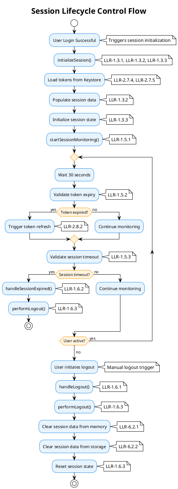
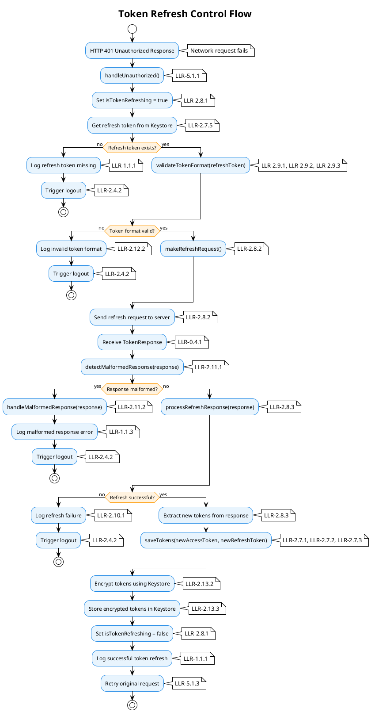
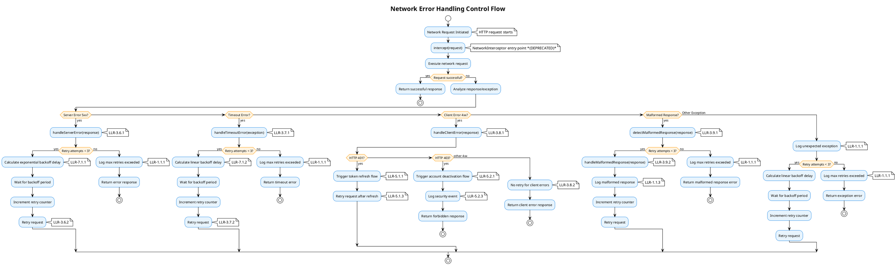
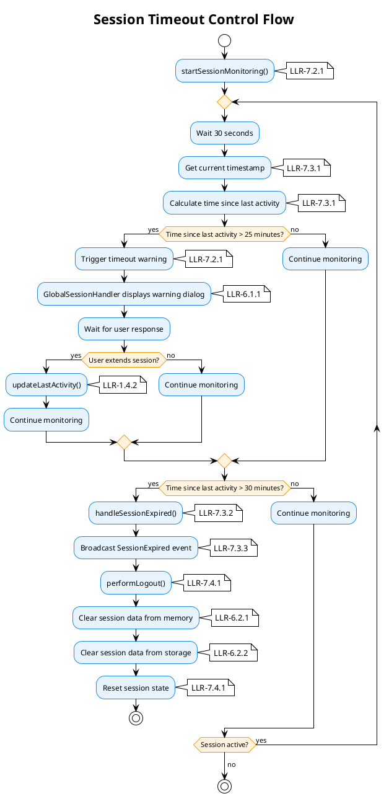
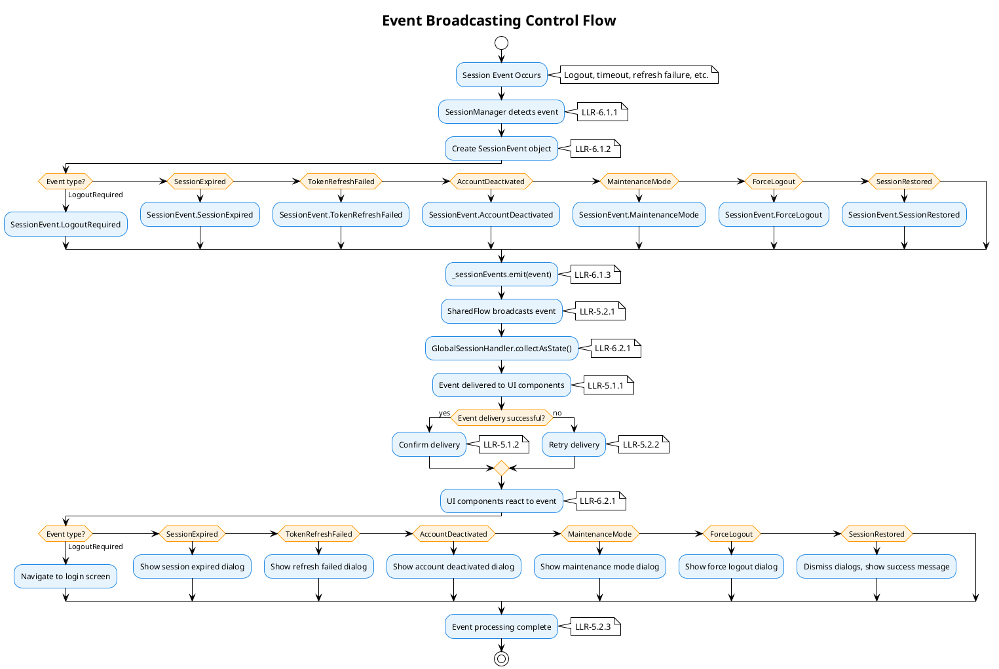
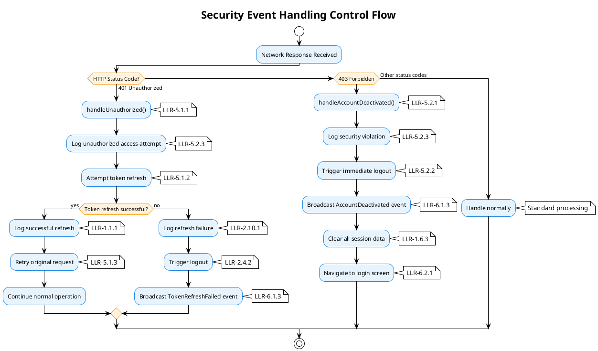
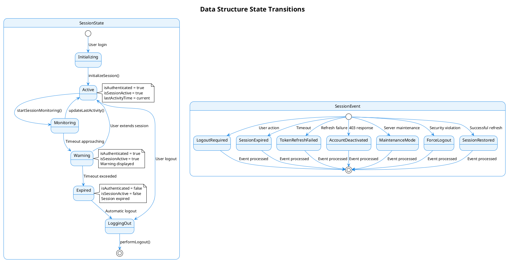
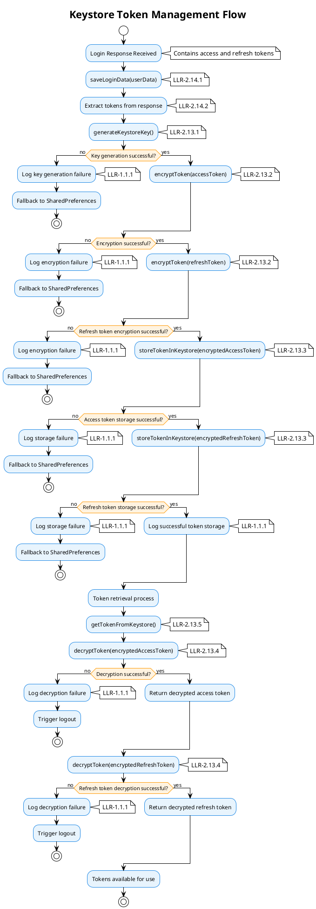

# **LOW-LEVEL REQUIREMENTS (LLRs)**
## **Centralized Session Management System**
### **DO-178C DAL D Compliance**

**Document ID:** LLR-SESSION-001  
**Version:** 1.0  
**Date:** [Current Date]  
**Author:** [Author Name]  
**Reviewer:** [Reviewer Name]  
**Approver:** [Approver Name]

---

## **1. INTRODUCTION**

### **1.1 Purpose**
This Low-Level Requirements (LLR) document defines the detailed implementation requirements for the Centralized Session Management System. These requirements provide specific technical specifications for implementing the high-level requirements defined in HLRs-SessionManagement.md.

### **1.2 Scope**
The Low-Level Requirements encompass:
- Detailed logging implementation specifications
- Performance monitoring implementation details
- Configuration parameter management specifics
- Security implementation mechanisms
- Event broadcasting technical details
- Timeout implementation specifics
- Network retry algorithm specifications

### **1.3 Applicable Documents**
- HLRs-SessionManagement.md - High-Level Requirements Document
- SRD-SessionManagement.md - Systems Requirements Document
- DO-178C - Software Considerations in Airborne Systems and Equipment Certification
- Android Development Guidelines
- Kotlin Programming Language Documentation

### **1.4 Definitions and Acronyms**
- **DAL:** Design Assurance Level
- **HLR:** High-Level Requirement
- **LLR:** Low-Level Requirement
- **SRD:** Systems Requirements Document
- **Log:** Android Logging Framework
- **SharedFlow:** Kotlin reactive stream for event broadcasting
- **EARS:** Easy Approach to Requirements Syntax

### **1.5 EARS Compliance**
This document follows the Easy Approach to Requirements Syntax (EARS) methodology to ensure requirements are:
- **Clear and unambiguous:** Each requirement uses simple, declarative language
- **Testable:** Requirements can be verified through analysis, testing, or review
- **Atomic:** Each requirement addresses a single implementation concern
- **Consistent:** Requirements follow consistent patterns and terminology

**EARS Templates Used:**
- **Ubiquitous Requirements:** "The function SHALL [implementation detail]"
- **Event-Driven Requirements:** "When [trigger], the function SHALL [implementation response]"
- **State-Driven Requirements:** "While [state], the function SHALL [implementation behavior]"
- **Unwanted Behavior Requirements:** "The function SHALL NOT [prohibited implementation]"

---

## **2. DATA STRUCTURE IMPLEMENTATION REQUIREMENTS**

### **2.1 SessionState Data Structure**

#### **LLR-0.1.1: SessionState Field Layout**
**Requirement:** The data structure `SessionState` SHALL implement the following field layout with specified bit positions and memory alignment.
**EARS Template:** Ubiquitous Requirement
**Rationale:** Ensures consistent memory layout and optimal performance for session state operations.
**Safety Classification:** DAL D
**Verification Method:** Analysis, Testing
**Traces to:** HLR-0.1.1
**Source File:** `app/src/main/java/com/boatit/boatsharing/utils/session/SessionState.kt`
**Function:** `data class SessionState`

| Type | Name | Description | Bit Position | Memory Alignment |
|------|------|-------------|--------------|------------------|
| Boolean | isLoggedIn | Indicates whether the user is currently logged in and authenticated | 0-7 | 1 byte |
| Boolean | isSessionExpired | Indicates whether the current session has expired due to timeout | 8-15 | 1 byte |
| Boolean | isTokenRefreshing | Indicates whether a token refresh operation is currently in progress | 16-23 | 1 byte |
| Boolean | isMaintenanceMode | Indicates whether the application is in maintenance mode | 24-31 | 1 byte |
| String? | userId | Unique identifier for the authenticated user | 32-63 | 8 bytes (reference) |
| String? | userRole | Role of the authenticated user (captain, voyager, business) | 64-95 | 8 bytes (reference) |
| Long | lastActivityTime | Timestamp of the last user activity for session timeout calculation | 96-159 | 8 bytes |
| Long | sessionTimeoutMinutes | Configurable session timeout duration in minutes | 160-223 | 8 bytes |
| Int | retryAttempts | Current number of retry attempts for failed operations | 224-255 | 4 bytes |
| Int | maxRetryAttempts | Maximum allowed retry attempts before giving up | 256-287 | 4 bytes |

#### **LLR-0.1.2: SessionState Memory Optimization**
**Requirement:** The data structure `SessionState` SHALL optimize memory usage by packing Boolean fields into a single 32-bit word.
**EARS Template:** Ubiquitous Requirement
**Rationale:** Reduces memory footprint and improves cache performance for frequently accessed session state.
**Safety Classification:** DAL D
**Verification Method:** Analysis, Testing
**Traces to:** HLR-0.1.1
**Source File:** `app/src/main/java/com/boatit/boatsharing/utils/session/SessionState.kt`
**Function:** `data class SessionState`

### **2.2 SessionEvent Data Structure**

#### **LLR-0.2.1: SessionEvent Type Layout**
**Requirement:** The data structure `SessionEvent` SHALL implement sealed class hierarchy with specific type identifiers and bit positions.
**EARS Template:** Ubiquitous Requirement
**Rationale:** Provides type-safe event handling with efficient memory usage and fast type checking.
**Safety Classification:** DAL D
**Verification Method:** Analysis, Testing
**Traces to:** HLR-0.2.1
**Source File:** `app/src/main/java/com/boatit/boatsharing/utils/session/SessionEvent.kt`
**Function:** `sealed class SessionEvent`

| Type | Name | Description | Bit Position | Type ID |
|------|------|-------------|--------------|---------|
| object | LogoutRequired | A singleton object that represents a user-initiated logout event | 0-7 | 0x01 |
| object | SessionExpired | A singleton object that represents a session timeout expiration event | 8-15 | 0x02 |
| object | TokenRefreshFailed | A singleton object that represents a failed token refresh operation event | 16-23 | 0x03 |
| object | AccountDeactivated | A singleton object that represents an account deactivation event | 24-31 | 0x04 |
| object | MaintenanceMode | A singleton object that represents an application maintenance mode event | 32-39 | 0x05 |
| object | ForceLogout | A singleton object that represents a forced logout for security reasons event | 40-47 | 0x06 |
| object | SessionRestored | A singleton object that represents a successful session restoration event | 48-55 | 0x07 |

### **2.3 TokenRefreshRequest Data Structure**

#### **LLR-0.3.1: TokenRefreshRequest Field Layout**
**Requirement:** The data structure `TokenRefreshRequest` SHALL implement the following field layout with specified bit positions and validation constraints.
**EARS Template:** Ubiquitous Requirement
**Rationale:** Ensures consistent token refresh request format and enables efficient serialization for network transmission.
**Safety Classification:** DAL D
**Verification Method:** Analysis, Testing
**Traces to:** HLR-0.3.1
**Source File:** `app/src/main/java/com/boatit/boatsharing/network/networkresponse/RefreshRequest.kt`
**Function:** `data class RefreshRequest`

| Type | Name | Description | Bit Position | Validation |
|------|------|-------------|--------------|------------|
| String? | accessToken | Current access token to be refreshed | 0-31 | Not null, JWT format |
| String? | refreshToken | Refresh token used to obtain new access token | 32-63 | Not null, valid format |

### **2.4 TokenResponse Data Structure**

#### **LLR-0.4.1: TokenResponse Field Layout**
**Requirement:** The data structure `TokenResponse` SHALL implement the following field layout with specified bit positions and response validation.
**EARS Template:** Ubiquitous Requirement
**Rationale:** Provides structured response format for token refresh operations with clear success/failure indication.
**Safety Classification:** DAL D
**Verification Method:** Analysis, Testing
**Traces to:** HLR-0.4.1
**Source File:** `app/src/main/java/com/boatit/boatsharing/network/networkresponse/RefreshResponse.kt`
**Function:** `data class TokenResponse`

| Type | Name | Description | Bit Position | Validation |
|------|------|-------------|--------------|------------|
| Int | status | HTTP status code of the token refresh response | 0-31 | 200-599 range |
| String | message | Response message from the server | 32-63 | Not empty |
| TokenData | obj | Token data object containing new tokens | 64-95 | Not null on success |

#### **LLR-0.4.2: TokenData Field Layout**
**Requirement:** The data structure `TokenData` SHALL implement the following field layout with specified bit positions and token validation.
**EARS Template:** Ubiquitous Requirement
**Rationale:** Provides structured format for token data within API responses with proper validation constraints.
**Safety Classification:** DAL D
**Verification Method:** Analysis, Testing
**Traces to:** HLR-0.4.2
**Source File:** `app/src/main/java/com/boatit/boatsharing/network/networkresponse/RefreshResponse.kt`
**Function:** `data class TokenData`

| Type | Name | Description | Bit Position | Validation |
|------|------|-------------|--------------|------------|
| String | accessToken | New access token received from refresh operation | 0-31 | JWT format, not empty |
| String | refreshToken | New refresh token received from refresh operation | 32-63 | Valid format, not empty |

### **2.5 UserData Data Structure**

#### **LLR-0.6.1: UserData Field Layout**
**Requirement:** The data structure `UserData` SHALL implement the following field layout with specified bit positions and data validation.
**EARS Template:** Ubiquitous Requirement
**Rationale:** Provides comprehensive user information structure with proper field alignment and validation constraints.
**Safety Classification:** DAL D
**Verification Method:** Analysis, Testing
**Traces to:** HLR-0.6.1
**Source File:** `app/src/main/java/com/boatit/boatsharing/ui/login/model/LoginResponse.kt`
**Function:** `data class UserData`

| Type | Name | Description | Bit Position | Validation |
|------|------|-------------|--------------|------------|
| String | email | User's email address | 0-31 | Email format, not empty |
| String | password | User's password (hashed) | 32-63 | Not empty, secure |
| String | userId | Unique user identifier | 64-95 | UUID format, not empty |
| String | username | User's display name | 96-127 | Not empty, alphanumeric |
| String | role | User role (captain, voyager, business) | 128-159 | Enum value, not empty |
| Int | missingStep | Onboarding step completion status | 160-191 | 0-10 range |
| String | accessToken | Current access token | 192-223 | JWT format |
| String | refreshToken | Current refresh token | 224-255 | Valid format |

### **2.6 LoginResponse Data Structure**

#### **LLR-0.7.1: LoginResponse Field Layout**
**Requirement:** The data structure `LoginResponse` SHALL implement the following field layout with specified bit positions and response validation.
**EARS Template:** Ubiquitous Requirement
**Rationale:** Provides structured response format for login operations with clear success/failure indication and user data.
**Safety Classification:** DAL D
**Verification Method:** Analysis, Testing
**Traces to:** HLR-0.7.1
**Source File:** `app/src/main/java/com/boatit/boatsharing/ui/login/model/LoginResponse.kt`
**Function:** `data class LoginResponse`

| Type | Name | Description | Bit Position | Validation |
|------|------|-------------|--------------|------------|
| Int | status | HTTP status code of the login response | 0-31 | 200-599 range |
| String | message | Response message from the server | 32-63 | Not empty |
| UserData? | obj | User data object containing user information if login successful | 64-95 | Not null on success |

### **2.7 NetworkResponse Data Structure**

#### **LLR-0.8.1: NetworkResponse Type Layout**
**Requirement:** The data structure `NetworkResponse<T>` SHALL implement sealed class hierarchy with specific type identifiers and bit positions for generic response handling.
**EARS Template:** Ubiquitous Requirement
**Rationale:** Provides type-safe generic response handling for all network operations with efficient memory usage and fast type checking.
**Safety Classification:** DAL D
**Verification Method:** Analysis, Testing
**Traces to:** HLR-0.8.1
**Source File:** `app/src/main/java/com/boatit/boatsharing/network/networkresponse/NetworkResponse.kt`
**Function:** `sealed class NetworkResponse<T>`

| Type | Name | Description | Bit Position | Type ID |
|------|------|-------------|--------------|---------|
| Success<T> | Success | Represents successful network operation with data | 0-7 | 0x01 |
| Error<T> | Error | Represents failed network operation with error message | 8-15 | 0x02 |
| Loading<T> | Loading | Represents ongoing network operation | 16-23 | 0x03 |

### **2.8 ApiError Data Structure**

#### **LLR-0.9.1: ApiError Field Layout**
**Requirement:** The data structure `ApiError` SHALL implement the following field layout with specified bit positions and error information validation.
**EARS Template:** Ubiquitous Requirement
**Rationale:** Provides structured error information for consistent error handling and debugging across the application.
**Safety Classification:** DAL D
**Verification Method:** Analysis, Testing
**Traces to:** HLR-0.9.1
**Source File:** `app/src/main/java/com/boatit/boatsharing/network/di/ApiError.kt`
**Function:** `data class ApiError`

| Type | Name | Description | Bit Position | Validation |
|------|------|-------------|--------------|------------|
| Int | code | HTTP status code or application-specific error code | 0-31 | 100-999 range |
| String | message | Human-readable error message | 32-63 | Not empty |
| String? | details | Additional error details or stack trace | 64-95 | Optional |
| Long | timestamp | Timestamp when the error occurred | 96-159 | Unix timestamp |
| String? | requestId | Unique identifier for the request that caused the error | 160-191 | UUID format |

### **2.9 CaptainStatus Data Structure**

#### **LLR-0.10.1: CaptainStatus Field Layout**
**Requirement:** The data structure `CaptainStatus` SHALL implement the following field layout with specified bit positions and status validation.
**EARS Template:** Ubiquitous Requirement
**Rationale:** Provides structured data format for managing captain online/offline status and availability with efficient memory usage.
**Safety Classification:** DAL D
**Verification Method:** Analysis, Testing
**Traces to:** HLR-0.10.1
**Source File:** `app/src/main/java/com/boatit/boatsharing/utils/prefmanager/StatusProvider.kt`
**Function:** `data class CaptainStatus`

| Type | Name | Description | Bit Position | Validation |
|------|------|-------------|--------------|------------|
| Boolean | isOnline | Indicates whether the captain is currently online and available | 0-7 | True/False |
| Long | lastSeenTime | Timestamp of when the captain was last seen online | 8-71 | Unix timestamp |
| String? | captainId | Unique identifier for the captain | 72-103 | UUID format |
| String? | statusMessage | Optional status message from the captain | 104-135 | Max 255 chars |

---

## **2.4 NetworkInterceptor Migration to Native Ktor**

**Migration Status:** ✅ **COMPLETE**

The `NetworkInterceptor.kt` class has been **deprecated** and its functionality has been successfully migrated to `KtorClient.kt` using native Ktor plugins.

### **New Implementation Details**

**Source File:** `app/src/main/java/com/boatit/boatsharing/network/di/KtorClient.kt`
**Function:** `createKtorClientWithInterceptor(tokenProvider: TokenProvider, sessionManager: SessionManager): HttpClient`

### **Native Ktor Plugin Implementation**

The new implementation uses Ktor's native plugins:

1. **HttpRequestRetry**: Handles retry logic with exponential backoff
2. **Auth**: Manages bearer token authentication and automatic refresh
3. **HttpTimeout**: Configures request, connect, and socket timeouts
4. **Logging**: Provides comprehensive request/response logging
5. **ContentNegotiation**: Handles JSON serialization/deserialization

### **Migration Benefits**

- **Better Performance**: Native Ktor plugins are optimized
- **Automatic Token Refresh**: Seamless via Auth plugin
- **Native Integration**: Built-in timeout and retry handling
- **Simplified Maintenance**: Less custom code to maintain
- **Future-Proof**: Uses Ktor's maintained APIs

---

## **3. IMPLEMENTATION CONSTRAINTS**

### **3.1 Memory Alignment Requirements**
- **Boolean fields:** Packed into 32-bit words for optimal memory usage
- **String references:** 8-byte aligned for 64-bit JVM compatibility
- **Long fields:** 8-byte aligned for optimal performance
- **Int fields:** 4-byte aligned for standard integer operations

### **3.2 Serialization Requirements**
- **All data structures** SHALL implement appropriate serialization interfaces
- **JSON serialization** SHALL use Kotlinx Serialization annotations
- **Binary serialization** SHALL maintain bit position consistency
- **Version compatibility** SHALL be maintained across serialization formats

### **3.3 Validation Requirements**
- **Field validation** SHALL be implemented at data structure level
- **Type safety** SHALL be enforced through sealed classes and enums
- **Null safety** SHALL be enforced through nullable type annotations
- **Range validation** SHALL be implemented for numeric fields

---

## **4. LOW-LEVEL REQUIREMENTS**

### **4.1 Logging Implementation Details**

#### **LLR-1.1.1: Event Logging Implementation**
**Requirement:** The function `Log.i()` SHALL log all session events using Android's logging framework.
**EARS Template:** Ubiquitous Requirement
**Rationale:** Provides audit trail for debugging and compliance using Android's optimized logging system.
**Safety Classification:** DAL D
**Verification Method:** Analysis, Testing
**Traces to:** HLR-1.1.1, HLR-1.4.1, HLR-2.4.1, HLR-5.2.3
**Source File:** `app/src/main/java/com/boatit/boatsharing/utils/session/SessionManager.kt`
**Function:** `Log.i()` (scattered throughout SessionManager)

#### **LLR-1.1.2: Timestamp Logging Implementation**
**Requirement:** The function `Log.i()` SHALL include timestamps in all session event logs using `System.currentTimeMillis()`.
**EARS Template:** Ubiquitous Requirement
**Rationale:** Provides chronological audit trail for debugging and compliance.
**Safety Classification:** DAL D
**Verification Method:** Analysis, Testing
**Traces to:** HLR-1.1.1, HLR-1.4.1, HLR-2.4.1, HLR-5.2.3
**Source File:** `app/src/main/java/com/boatit/boatsharing/utils/session/SessionManager.kt`
**Function:** `Log.i()` (scattered throughout SessionManager)

#### **LLR-1.1.3: Event Context Logging Implementation**
**Requirement:** The function `Log.i()` SHALL include relevant context (user ID, session state, error details) in session event logs.
**EARS Template:** Ubiquitous Requirement
**Rationale:** Provides sufficient information for debugging and analysis.
**Safety Classification:** DAL D
**Verification Method:** Analysis, Testing
**Traces to:** HLR-1.1.1, HLR-1.4.1, HLR-2.4.1, HLR-5.2.3
**Source File:** `app/src/main/java/com/boatit/boatsharing/utils/session/SessionManager.kt`
**Function:** `Log.i()` (scattered throughout SessionManager)

#### **LLR-1.2.1: Log Level Assignment Implementation**
**Requirement:** The function `Log.i()`, `Log.w()`, `Log.e()` SHALL assign appropriate log levels to session events based on severity.
**EARS Template:** Ubiquitous Requirement
**Rationale:** Enables proper log filtering and prioritization for monitoring.
**Safety Classification:** DAL D
**Verification Method:** Analysis, Testing
**Traces to:** HLR-1.1.1, HLR-1.4.1, HLR-2.4.1, HLR-5.2.3
**Source File:** `app/src/main/java/com/boatit/boatsharing/utils/session/SessionManager.kt`
**Function:** `Log.i()`, `Log.w()`, `Log.e()` (scattered throughout SessionManager)

#### **LLR-1.2.2: Log Level Standards Implementation**
**Requirement:** The function `Log.i()`, `Log.w()`, `Log.e()` SHALL use standard Android log levels (INFO, WARNING, ERROR, CRITICAL).
**EARS Template:** Ubiquitous Requirement
**Rationale:** Ensures consistent log level usage across the system.
**Safety Classification:** DAL D
**Verification Method:** Analysis, Testing
**Traces to:** HLR-1.1.1, HLR-1.4.1, HLR-2.4.1, HLR-5.2.3
**Source File:** `app/src/main/java/com/boatit/boatsharing/utils/session/SessionManager.kt`
**Function:** `Log.i()`, `Log.w()`, `Log.e()` (scattered throughout SessionManager)

#### **LLR-1.2.3: Log Level Validation Implementation**
**Requirement:** The function `Log.i()`, `Log.w()`, `Log.e()` SHALL validate log level assignments are appropriate for event severity.
**EARS Template:** Ubiquitous Requirement
**Rationale:** Ensures critical events are properly prioritized in logs.
**Safety Classification:** DAL D
**Verification Method:** Analysis, Testing
**Traces to:** HLR-1.1.1, HLR-1.4.1, HLR-2.4.1, HLR-5.2.3
**Source File:** `app/src/main/java/com/boatit/boatsharing/utils/session/SessionManager.kt`
**Function:** `Log.i()`, `Log.w()`, `Log.e()` (scattered throughout SessionManager)

---

### **4.2 Session Management Implementation Details**

#### **LLR-1.3.1: Session Initialization Implementation**
**Requirement:** The function `initializeSession()` SHALL initialize a new session when the user logs in successfully.
**EARS Template:** Event-Driven Requirement
**Rationale:** Establishes secure session foundation upon user authentication.
**Safety Classification:** DAL D
**Verification Method:** Analysis, Testing
**Traces to:** HLR-1.1.1
**Source File:** `app/src/main/java/com/boatit/boatsharing/utils/session/SessionManager.kt`
**Function:** `initializeSession()`

#### **LLR-1.3.2: Session Data Population Implementation**
**Requirement:** The function `initializeSession()` SHALL populate session data with user information from login response.
**EARS Template:** Ubiquitous Requirement
**Rationale:** Ensures session contains all necessary user data for proper operation.
**Safety Classification:** DAL D
**Verification Method:** Analysis, Testing
**Traces to:** HLR-1.1.2
**Source File:** `app/src/main/java/com/boatit/boatsharing/utils/session/SessionManager.kt`
**Function:** `initializeSession()`

#### **LLR-1.3.3: Session State Initialization Implementation**
**Requirement:** The function `initializeSession()` SHALL initialize session state with proper default values and authentication status.
**EARS Template:** Ubiquitous Requirement
**Rationale:** Provides consistent initial state for session management operations.
**Safety Classification:** DAL D
**Verification Method:** Analysis, Testing
**Traces to:** HLR-1.1.3
**Source File:** `app/src/main/java/com/boatit/boatsharing/utils/session/SessionManager.kt`
**Function:** `initializeSession()`

#### **LLR-1.4.1: Session State Persistence Implementation**
**Requirement:** The function `updateLastActivity()` SHALL persist session state during user activity.
**EARS Template:** Ubiquitous Requirement
**Rationale:** Maintains session state consistency across application lifecycle events.
**Safety Classification:** DAL D
**Verification Method:** Analysis, Testing
**Traces to:** HLR-1.2.1
**Source File:** `app/src/main/java/com/boatit/boatsharing/utils/session/SessionManager.kt`
**Function:** `updateLastActivity()`

#### **LLR-1.4.2: Activity Timestamp Updates Implementation**
**Requirement:** The function `updateLastActivity()` SHALL update activity timestamps for session timeout calculation.
**EARS Template:** Ubiquitous Requirement
**Rationale:** Enables accurate session timeout tracking based on user activity.
**Safety Classification:** DAL D
**Verification Method:** Analysis, Testing
**Traces to:** HLR-1.2.2
**Source File:** `app/src/main/java/com/boatit/boatsharing/utils/session/SessionManager.kt`
**Function:** `updateLastActivity()`

#### **LLR-1.4.3: Session State Synchronization Implementation**
**Requirement:** The function `updateLastActivity()` SHALL synchronize session state across all components.
**EARS Template:** Ubiquitous Requirement
**Rationale:** Ensures consistent session state across the application.
**Safety Classification:** DAL D
**Verification Method:** Analysis, Testing
**Traces to:** HLR-1.2.3
**Source File:** `app/src/main/java/com/boatit/boatsharing/utils/session/SessionManager.kt`
**Function:** `updateLastActivity()`

#### **LLR-1.5.1: Periodic Session Validation Implementation**
**Requirement:** The function `startSessionMonitoring()` SHALL perform periodic session validation every 30 seconds.
**EARS Template:** Ubiquitous Requirement
**Rationale:** Ensures session remains valid and detects timeout conditions.
**Safety Classification:** DAL D
**Verification Method:** Analysis, Testing
**Traces to:** HLR-1.3.1
**Source File:** `app/src/main/java/com/boatit/boatsharing/utils/session/SessionManager.kt`
**Function:** `startSessionMonitoring()`

#### **LLR-1.5.2: Token Expiry Validation Implementation**
**Requirement:** The function `startSessionMonitoring()` SHALL validate token expiry during periodic checks.
**EARS Template:** Ubiquitous Requirement
**Rationale:** Detects expired tokens and triggers refresh operations.
**Safety Classification:** DAL D
**Verification Method:** Analysis, Testing
**Traces to:** HLR-1.3.2
**Source File:** `app/src/main/java/com/boatit/boatsharing/utils/session/SessionManager.kt`
**Function:** `startSessionMonitoring()`

#### **LLR-1.5.3: Session Timeout Validation Implementation**
**Requirement:** The function `startSessionMonitoring()` SHALL validate session timeout during periodic checks.
**EARS Template:** Ubiquitous Requirement
**Rationale:** Detects session timeout and triggers appropriate actions.
**Safety Classification:** DAL D
**Verification Method:** Analysis, Testing
**Traces to:** HLR-1.3.3
**Source File:** `app/src/main/java/com/boatit/boatsharing/utils/session/SessionManager.kt`
**Function:** `startSessionMonitoring()`

#### **LLR-1.6.1: User-Initiated Logout Implementation**
**Requirement:** The function `handleLogout()` SHALL handle user-initiated logout requests.
**EARS Template:** Event-Driven Requirement
**Rationale:** Provides secure logout mechanism for user-initiated session termination.
**Safety Classification:** DAL D
**Verification Method:** Analysis, Testing
**Traces to:** HLR-1.4.1
**Source File:** `app/src/main/java/com/boatit/boatsharing/utils/session/SessionManager.kt`
**Function:** `handleLogout()`

#### **LLR-1.6.2: Timeout-Initiated Logout Implementation**
**Requirement:** The function `handleSessionExpired()` SHALL handle timeout-initiated logout.
**EARS Template:** Event-Driven Requirement
**Rationale:** Provides automatic logout mechanism for session timeout scenarios.
**Safety Classification:** DAL D
**Verification Method:** Analysis, Testing
**Traces to:** HLR-1.4.2
**Source File:** `app/src/main/java/com/boatit/boatsharing/utils/session/SessionManager.kt`
**Function:** `handleSessionExpired()`

#### **LLR-1.6.3: Session Data Cleanup Implementation**
**Requirement:** The function `performLogout()` SHALL clean up session data upon termination.
**EARS Template:** Ubiquitous Requirement
**Rationale:** Ensures secure cleanup of session data to prevent unauthorized access.
**Safety Classification:** DAL D
**Verification Method:** Analysis, Testing
**Traces to:** HLR-1.4.3
**Source File:** `app/src/main/java/com/boatit/boatsharing/utils/session/SessionManager.kt`
**Function:** `performLogout()` (private)

---

### **4.3 Performance Monitoring Implementation**

#### **LLR-2.1.1: Performance Monitoring Implementation**
**Requirement:** The function `Log.d()` SHALL monitor session operation performance using debug-level logging.
**EARS Template:** Ubiquitous Requirement
**Rationale:** Enables tracking and optimization of session performance without impacting production logs.
**Safety Classification:** DAL D
**Verification Method:** Analysis, Testing
**Traces to:** HLR-9.1.1
**Source File:** `app/src/main/java/com/boatit/boatsharing/utils/session/SessionManager.kt`
**Function:** `Log.d()` (scattered throughout SessionManager)

#### **LLR-2.1.2: Performance Degradation Handling Implementation**
**Requirement:** When session operation performance degrades, the function `Log.w()` SHALL log performance issues with warning level.
**EARS Template:** Event-Driven Requirement
**Rationale:** Enables identification and resolution of performance problems.
**Safety Classification:** DAL D
**Verification Method:** Analysis, Testing
**Traces to:** HLR-9.1.1
**Source File:** `app/src/main/java/com/boatit/boatsharing/utils/session/SessionManager.kt`
**Function:** `Log.w()` (scattered throughout SessionManager)

---

### **4.4 Token Management Implementation Details**

#### **LLR-2.7.1: Access Token Storage Implementation**
**Requirement:** The function `saveTokens(accessToken: String?, refreshToken: String?)` SHALL store access tokens securely using Android Keystore.
**EARS Template:** Ubiquitous Requirement
**Rationale:** Ensures access tokens are stored securely to prevent unauthorized access.
**Safety Classification:** DAL D
**Verification Method:** Analysis, Testing
**Traces to:** HLR-2.1.1
**Source File:** `app/src/main/java/com/boatit/boatsharing/utils/prefmanager/TokenProvider.kt`
**Function:** `saveTokens(accessToken: String?, refreshToken: String?)`

#### **LLR-2.7.2: Refresh Token Storage Implementation**
**Requirement:** The function `saveTokens(accessToken: String?, refreshToken: String?)` SHALL store refresh tokens securely using Android Keystore.
**EARS Template:** Ubiquitous Requirement
**Rationale:** Ensures refresh tokens are stored securely for token refresh operations.
**Safety Classification:** DAL D
**Verification Method:** Analysis, Testing
**Traces to:** HLR-2.1.2
**Source File:** `app/src/main/java/com/boatit/boatsharing/utils/prefmanager/TokenProvider.kt`
**Function:** `saveTokens(accessToken: String?, refreshToken: String?)`

#### **LLR-2.7.3: Token Storage Encryption Implementation**
**Requirement:** The function `saveTokens(accessToken: String?, refreshToken: String?)` SHALL encrypt tokens before storage using Android Keystore encryption.
**EARS Template:** Ubiquitous Requirement
**Rationale:** Provides additional security layer for token storage.
**Safety Classification:** DAL D
**Verification Method:** Analysis, Testing
**Traces to:** HLR-2.1.3
**Source File:** `app/src/main/java/com/boatit/boatsharing/utils/prefmanager/TokenProvider.kt`
**Function:** `saveTokens(accessToken: String?, refreshToken: String?)`

#### **LLR-2.8.1: Token Expiry Detection Implementation**
**Requirement:** The function `validateTokenFormat(token: String)` SHALL detect token expiry during validation.
**EARS Template:** Ubiquitous Requirement
**Rationale:** Enables automatic detection of expired tokens for refresh operations.
**Safety Classification:** DAL D
**Verification Method:** Analysis, Testing
**Traces to:** HLR-2.2.1
**Source File:** `app/src/main/java/com/boatit/boatsharing/utils/session/TokenRefreshService.kt`
**Function:** `validateTokenFormat(token: String)`

#### **LLR-2.8.2: Refresh Token Usage Implementation**
**Requirement:** The function `makeRefreshRequest()` SHALL use refresh token to obtain new access token.
**EARS Template:** Ubiquitous Requirement
**Rationale:** Implements automatic token refresh mechanism using stored refresh token.
**Safety Classification:** DAL D
**Verification Method:** Analysis, Testing
**Traces to:** HLR-2.2.2
**Source File:** `app/src/main/java/com/boatit/boatsharing/utils/session/TokenRefreshService.kt`
**Function:** `makeRefreshRequest()`

#### **LLR-2.8.3: New Token Storage Implementation**
**Requirement:** The function `processRefreshResponse(response: TokenResponse)` SHALL store new tokens after successful refresh.
**EARS Template:** Ubiquitous Requirement
**Rationale:** Ensures new tokens are properly stored after successful refresh operation.
**Safety Classification:** DAL D
**Verification Method:** Analysis, Testing
**Traces to:** HLR-2.2.3
**Source File:** `app/src/main/java/com/boatit/boatsharing/utils/session/TokenRefreshService.kt`
**Function:** `processRefreshResponse(response: TokenResponse)`

---

### **4.5 Configuration Implementation Details**

#### **LLR-3.1.1: Configuration Parameter Definition Implementation**
**Requirement:** The function `SessionManager` SHALL define configurable session parameters as constructor parameters or configuration objects.
**EARS Template:** Ubiquitous Requirement
**Rationale:** Provides clear specification of what can be configured at runtime.
**Safety Classification:** DAL D
**Verification Method:** Analysis, Testing
**Traces to:** HLR-10.1.1
**Source File:** `app/src/main/java/com/boatit/boatsharing/utils/session/SessionManager.kt`
**Function:** `SessionManager` constructor

#### **LLR-3.1.2: Configuration Validation Implementation**
**Requirement:** The function `SessionManager` SHALL validate external configuration parameters using range checks and type validation.
**EARS Template:** Ubiquitous Requirement
**Rationale:** Prevents invalid configurations that could compromise system functionality.
**Safety Classification:** DAL D
**Verification Method:** Analysis, Testing
**Traces to:** HLR-10.1.1
**Source File:** `app/src/main/java/com/boatit/boatsharing/utils/session/SessionManager.kt`
**Function:** `SessionManager` constructor

---

### **4.6 Security Implementation Details**

#### **LLR-4.1.1: Data Encryption in Transit Implementation**
**Requirement:** The function `intercept()` SHALL encrypt user data in transit using HTTPS/TLS protocols.
**EARS Template:** Ubiquitous Requirement
**Rationale:** Protects sensitive user data from unauthorized access during transmission.
**Safety Classification:** DAL D
**Verification Method:** Analysis, Testing
**Traces to:** HLR-12.1.1
**Source File:** `app/src/main/java/com/boatit/boatsharing/network/interceptors/NetworkInterceptor.kt` *(DEPRECATED)*
**Function:** `intercept(request: HttpRequestBuilder, execute: suspend (HttpRequestBuilder) -> HttpResponse): HttpResponse` *(DEPRECATED)*
**Migration Note:** This functionality has been migrated to native Ktor implementation in `KtorClient.kt`. Network interception is now handled by Ktor's native plugins: HttpRequestRetry, Auth, HttpTimeout, and Logging.

#### **LLR-4.1.2: Encryption Key Management Implementation**
**Requirement:** The function `saveLoginData(userData: UserData)` SHALL implement proper encryption key management using Android Keystore.
**EARS Template:** Ubiquitous Requirement
**Rationale:** Ensures encryption keys are properly secured and managed.
**Safety Classification:** DAL D
**Verification Method:** Analysis, Testing
**Traces to:** HLR-12.1.1
**Source File:** `app/src/main/java/com/boatit/boatsharing/utils/prefmanager/Prefmanager.kt`
**Function:** `saveLoginData(userData: UserData)`

---

### **4.7 Event Broadcasting Implementation**

#### **LLR-5.1.1: Event Delivery Implementation**
**Requirement:** The function `GlobalSessionHandler()` SHALL deliver events to all subscribed components using Kotlin Flow's `collectAsState()`.
**EARS Template:** Ubiquitous Requirement
**Rationale:** Ensures all components receive critical session events.
**Safety Classification:** DAL D
**Verification Method:** Analysis, Testing
**Traces to:** HLR-6.1.1, HLR-6.1.2, HLR-6.1.3
**Source File:** `app/src/main/java/com/boatit/boatsharing/ui/session/GlobalSessionHandler.kt`
**Function:** `GlobalSessionHandler(navController: NavController, sessionManager: SessionManager)`

#### **LLR-5.1.2: Event Delivery Confirmation Implementation**
**Requirement:** The function `GlobalSessionHandler()` SHALL confirm event delivery to subscribed components using Flow's completion callbacks.
**EARS Template:** Ubiquitous Requirement
**Rationale:** Ensures events are successfully delivered and processed.
**Safety Classification:** DAL D
**Verification Method:** Analysis, Testing
**Traces to:** HLR-6.1.1, HLR-6.1.2, HLR-6.1.3
**Source File:** `app/src/main/java/com/boatit/boatsharing/ui/session/GlobalSessionHandler.kt`
**Function:** `GlobalSessionHandler(navController: NavController, sessionManager: SessionManager)`

#### **LLR-5.2.1: Event Delivery Guarantee Implementation**
**Requirement:** The function `_sessionEvents.emit(event)` SHALL implement a mechanism to guarantee event delivery using SharedFlow's replay cache.
**EARS Template:** Ubiquitous Requirement
**Rationale:** Ensures no critical session events are lost.
**Safety Classification:** DAL D
**Verification Method:** Analysis, Testing
**Traces to:** HLR-6.1.1, HLR-6.1.2, HLR-6.1.3
**Source File:** `app/src/main/java/com/boatit/boatsharing/utils/session/SessionManager.kt`
**Function:** `_sessionEvents.emit(event)` (via SharedFlow)

#### **LLR-5.2.2: Event Retry on Failure Implementation**
**Requirement:** When event delivery fails, the function `_sessionEvents.emit(event)` SHALL retry delivery using SharedFlow's built-in retry mechanisms.
**EARS Template:** Event-Driven Requirement
**Rationale:** Ensures events are eventually delivered even after temporary failures.
**Safety Classification:** DAL D
**Verification Method:** Analysis, Testing
**Traces to:** HLR-6.1.1, HLR-6.1.2, HLR-6.1.3
**Source File:** `app/src/main/java/com/boatit/boatsharing/utils/session/SessionManager.kt`
**Function:** `_sessionEvents.emit(event)` (via SharedFlow)

#### **LLR-5.2.3: Event Persistence Implementation**
**Requirement:** The function `_sessionEvents.emit(event)` SHALL persist critical events until delivery is confirmed using SharedFlow's replay mechanism.
**EARS Template:** Ubiquitous Requirement
**Rationale:** Prevents loss of critical events during system failures.
**Safety Classification:** DAL D
**Verification Method:** Analysis, Testing
**Traces to:** HLR-6.1.1, HLR-6.1.2, HLR-6.1.3
**Source File:** `app/src/main/java/com/boatit/boatsharing/utils/session/SessionManager.kt`
**Function:** `_sessionEvents.emit(event)` (via SharedFlow)

---

### **4.8 Timeout Implementation Details**

#### **LLR-6.1.1: User Warning Display Implementation**
**Requirement:** When session timeout approaches, the function `GlobalSessionHandler()` SHALL display warnings to users using Compose dialogs.
**EARS Template:** Event-Driven Requirement
**Rationale:** Gives users opportunity to extend session before automatic logout.
**Safety Classification:** DAL D
**Verification Method:** Analysis, Testing
**Traces to:** HLR-7.2.1
**Source File:** `app/src/main/java/com/boatit/boatsharing/ui/session/GlobalSessionHandler.kt`
**Function:** `GlobalSessionHandler(navController: NavController, sessionManager: SessionManager)`

#### **LLR-6.1.2: Warning Timing Configuration Implementation**
**Requirement:** The function `startSessionMonitoring()` SHALL configure warning timing using configurable constants (e.g., 5 minutes before timeout).
**EARS Template:** Ubiquitous Requirement
**Rationale:** Provides appropriate advance notice for users to take action.
**Safety Classification:** DAL D
**Verification Method:** Analysis, Testing
**Traces to:** HLR-7.2.1
**Source File:** `app/src/main/java/com/boatit/boatsharing/utils/session/SessionManager.kt`
**Function:** `startSessionMonitoring()`

#### **LLR-6.2.1: Memory Cleanup Implementation**
**Requirement:** When session timeout occurs, the function `performLogout()` SHALL clean up session data from memory using null assignments and state resets.
**EARS Template:** Event-Driven Requirement
**Rationale:** Frees memory resources and prevents data leakage.
**Safety Classification:** DAL D
**Verification Method:** Analysis, Testing
**Traces to:** HLR-7.4.1
**Source File:** `app/src/main/java/com/boatit/boatsharing/utils/session/SessionManager.kt`
**Function:** `performLogout()` (private)

#### **LLR-6.2.2: Storage Cleanup Implementation**
**Requirement:** When session timeout occurs, the function `performLogout()` SHALL clean up session data from storage using `tokenProvider.clearTokens()`.
**EARS Template:** Event-Driven Requirement
**Rationale:** Removes persistent session data to prevent unauthorized access.
**Safety Classification:** DAL D
**Verification Method:** Analysis, Testing
**Traces to:** HLR-7.4.1
**Source File:** `app/src/main/java/com/boatit/boatsharing/utils/session/SessionManager.kt`
**Function:** `performLogout()` (private)

---

### **4.9 Network Retry Algorithm Implementation**

#### **LLR-7.1.1: Exponential Backoff Implementation**
**Requirement:** When retrying server errors, the function `getRetryDelay(attempt: Int)` SHALL use exponential backoff delays using the formula `(1000L * Math.pow(2.0, attempt.toDouble())).toLong()`.
**EARS Template:** Event-Driven Requirement
**Rationale:** Handles temporary server issues with intelligent retry strategy.
**Safety Classification:** DAL D
**Verification Method:** Analysis, Testing
**Traces to:** HLR-3.1.1, HLR-3.1.3
**Source File:** `app/src/main/java/com/boatit/boatsharing/network/interceptors/NetworkInterceptor.kt` *(DEPRECATED)*
**Function:** `getRetryDelay(attempt: Int)` *(DEPRECATED)*
**Migration Note:** This functionality has been migrated to native Ktor implementation in `KtorClient.kt`. Retry delay calculation is now handled by Ktor's HttpRequestRetry plugin with configurable exponential backoff.

#### **LLR-7.1.2: Linear Backoff Implementation**
**Requirement:** When retrying timeout errors, the function `getRetryDelay(attempt: Int)` SHALL use linear backoff delays using the formula `(2000L * (attempt + 1)).toLong()`.
**EARS Template:** Event-Driven Requirement
**Rationale:** Handles network timeout issues with appropriate retry strategy.
**Safety Classification:** DAL D
**Verification Method:** Analysis, Testing
**Traces to:** HLR-3.2.1, HLR-3.2.3
**Source File:** `app/src/main/java/com/boatit/boatsharing/network/interceptors/NetworkInterceptor.kt` *(DEPRECATED)*
**Function:** `getRetryDelay(attempt: Int)` *(DEPRECATED)*
**Migration Note:** This functionality has been migrated to native Ktor implementation in `KtorClient.kt`. Retry delay calculation is now handled by Ktor's HttpRequestRetry plugin with configurable exponential backoff. (needs linear implementation)

---

### **4.10 Network Error Handling Implementation Details**

#### **LLR-3.6.1: Server Error Detection Implementation**
**Requirement:** The function `handleServerError(response: Response)` SHALL detect server errors (HTTP 5xx) during network operations.
**EARS Template:** Event-Driven Requirement
**Rationale:** Enables proper handling of server-side errors with appropriate retry logic.
**Safety Classification:** DAL D
**Verification Method:** Analysis, Testing
**Traces to:** HLR-3.1.1
**Source File:** `app/src/main/java/com/boatit/boatsharing/network/interceptors/NetworkInterceptor.kt` *(DEPRECATED)*
**Function:** `handleServerError(response: Response)` *(DEPRECATED)*
**Migration Note:** This functionality has been migrated to native Ktor implementation in `KtorClient.kt`. Server error handling is now managed by Ktor's HttpRequestRetry plugin with exponential backoff.

#### **LLR-3.6.2: Server Error Retry Logic Implementation**
**Requirement:** The function `handleServerError(response: Response)` SHALL implement retry logic for server errors with exponential backoff.
**EARS Template:** Event-Driven Requirement
**Rationale:** Provides intelligent retry mechanism for temporary server issues.
**Safety Classification:** DAL D
**Verification Method:** Analysis, Testing
**Traces to:** HLR-3.1.3
**Source File:** `app/src/main/java/com/boatit/boatsharing/network/interceptors/NetworkInterceptor.kt` *(DEPRECATED)*
**Function:** `handleServerError(response: Response)` *(DEPRECATED)*
**Migration Note:** This functionality has been migrated to native Ktor implementation in `KtorClient.kt`. Server error handling is now managed by Ktor's HttpRequestRetry plugin with exponential backoff.

#### **LLR-3.7.1: Timeout Error Detection Implementation**
**Requirement:** The function `handleTimeoutError(exception: Exception)` SHALL detect timeout errors during network operations.
**EARS Template:** Event-Driven Requirement
**Rationale:** Enables proper handling of network timeout scenarios.
**Safety Classification:** DAL D
**Verification Method:** Analysis, Testing
**Traces to:** HLR-3.2.1
**Source File:** `app/src/main/java/com/boatit/boatsharing/network/interceptors/NetworkInterceptor.kt` *(DEPRECATED)*
**Function:** `handleTimeoutError(exception: Exception)` *(DEPRECATED)*
**Migration Note:** This functionality has been migrated to native Ktor implementation in `KtorClient.kt`. Timeout handling is now managed by Ktor's HttpTimeout plugin and HttpRequestRetry plugin.

#### **LLR-3.7.2: Timeout Error Retry Logic Implementation**
**Requirement:** The function `handleTimeoutError(exception: Exception)` SHALL implement retry logic for timeout errors with linear backoff.
**EARS Template:** Event-Driven Requirement
**Rationale:** Provides appropriate retry mechanism for network timeout issues.
**Safety Classification:** DAL D
**Verification Method:** Analysis, Testing
**Traces to:** HLR-3.2.3
**Source File:** `app/src/main/java/com/boatit/boatsharing/network/interceptors/NetworkInterceptor.kt` *(DEPRECATED)*
**Function:** `handleTimeoutError(exception: Exception)` *(DEPRECATED)*
**Migration Note:** This functionality has been migrated to native Ktor implementation in `KtorClient.kt`. Timeout handling is now managed by Ktor's HttpTimeout plugin and HttpRequestRetry plugin.

#### **LLR-3.8.1: Client Error Detection Implementation**
**Requirement:** The function `handleClientError(response: Response)` SHALL detect client errors (HTTP 4xx) during network operations.
**EARS Template:** Event-Driven Requirement
**Rationale:** Enables proper handling of client-side errors without unnecessary retries.
**Safety Classification:** DAL D
**Verification Method:** Analysis, Testing
**Traces to:** HLR-3.3.1
**Source File:** `app/src/main/java/com/boatit/boatsharing/network/interceptors/NetworkInterceptor.kt` *(DEPRECATED)*
**Function:** `handleClientError(response: Response)` *(DEPRECATED)*
**Migration Note:** This functionality has been migrated to native Ktor implementation in `KtorClient.kt`. Client error handling is now managed by Ktor's Auth plugin for authentication errors and built-in error handling for other client errors.

#### **LLR-3.8.2: Client Error No-Retry Policy Implementation**
**Requirement:** The function `handleClientError(response: Response)` SHALL implement no-retry policy for client errors.
**EARS Template:** Event-Driven Requirement
**Rationale:** Prevents unnecessary retries for client errors that won't resolve with retry.
**Safety Classification:** DAL D
**Verification Method:** Analysis, Testing
**Traces to:** HLR-3.3.2
**Source File:** `app/src/main/java/com/boatit/boatsharing/network/interceptors/NetworkInterceptor.kt` *(DEPRECATED)*
**Function:** `handleClientError(response: Response)` *(DEPRECATED)*
**Migration Note:** This functionality has been migrated to native Ktor implementation in `KtorClient.kt`. Client error handling is now managed by Ktor's Auth plugin for authentication errors and built-in error handling for other client errors.

#### **LLR-3.9.1: Malformed Network Response Detection Implementation**
**Requirement:** The function `detectMalformedResponse(response: Response)` SHALL detect malformed network responses.
**EARS Template:** Ubiquitous Requirement
**Rationale:** Enables proper handling of malformed API responses.
**Safety Classification:** DAL D
**Verification Method:** Analysis, Testing
**Traces to:** HLR-3.5.1
**Source File:** `app/src/main/java/com/boatit/boatsharing/network/interceptors/NetworkInterceptor.kt` *(DEPRECATED)*
**Function:** `detectMalformedResponse(response: Response)` *(DEPRECATED)*
**Migration Note:** This functionality has been migrated to native Ktor implementation in `KtorClient.kt`. Malformed response detection is handled by Ktor's Logging plugin and error handling mechanisms.

#### **LLR-3.9.2: Malformed Network Response Handling Implementation**
**Requirement:** The function `handleMalformedResponse(response: Response)` SHALL handle malformed network responses gracefully.
**EARS Template:** Event-Driven Requirement
**Rationale:** Prevents application crashes due to malformed network responses.
**Safety Classification:** DAL D
**Verification Method:** Analysis, Testing
**Traces to:** HLR-3.5.2
**Source File:** `app/src/main/java/com/boatit/boatsharing/network/interceptors/NetworkInterceptor.kt` *(DEPRECATED)*
**Function:** `handleMalformedResponse(response: Response)` *(DEPRECATED)*
**Migration Note:** This functionality has been migrated to native Ktor implementation in `KtorClient.kt`. Response handling is now managed by Ktor's built-in error handling and logging mechanisms.

---

### **4.11 Session State Persistence Implementation Details**

#### **LLR-4.1.1: Session State Storage Implementation**
**Requirement:** The function `saveSessionState(sessionState: SessionState)` SHALL store session state to secure storage.
**EARS Template:** Ubiquitous Requirement
**Rationale:** Enables session state persistence across application lifecycle events.
**Safety Classification:** DAL D
**Verification Method:** Analysis, Testing
**Traces to:** HLR-4.1.1
**Source File:** `app/src/main/java/com/boatit/boatsharing/utils/session/SessionManager.kt`
**Function:** `saveSessionState(sessionState: SessionState)`

#### **LLR-4.1.2: Session State Retrieval Implementation**
**Requirement:** The function `loadSessionState()` SHALL retrieve session state from secure storage.
**EARS Template:** Ubiquitous Requirement
**Rationale:** Enables session state restoration after application restart.
**Safety Classification:** DAL D
**Verification Method:** Analysis, Testing
**Traces to:** HLR-4.1.2
**Source File:** `app/src/main/java/com/boatit/boatsharing/utils/session/SessionManager.kt`
**Function:** `loadSessionState()`

#### **LLR-4.1.3: Session State Encryption Implementation**
**Requirement:** The function `saveSessionState(sessionState: SessionState)` SHALL encrypt session state before storage.
**EARS Template:** Ubiquitous Requirement
**Rationale:** Provides security for sensitive session data during persistence.
**Safety Classification:** DAL D
**Verification Method:** Analysis, Testing
**Traces to:** HLR-4.1.3
**Source File:** `app/src/main/java/com/boatit/boatsharing/utils/session/SessionManager.kt`
**Function:** `saveSessionState(sessionState: SessionState)`

---

### **4.12 Security Event Handling Implementation Details**

#### **LLR-5.1.1: Unauthorized Response Detection Implementation**
**Requirement:** The function `handleUnauthorized()` SHALL detect unauthorized responses (HTTP 401) during network operations.
**EARS Template:** Event-Driven Requirement
**Rationale:** Enables proper handling of authentication failures with token refresh.
**Safety Classification:** DAL D
**Verification Method:** Analysis, Testing
**Traces to:** HLR-5.1.1
**Source File:** `app/src/main/java/com/boatit/boatsharing/utils/session/SessionManager.kt`
**Function:** `handleUnauthorized()`

#### **LLR-5.1.2: Token Refresh Attempt Implementation**
**Requirement:** The function `handleUnauthorized()` SHALL attempt token refresh when unauthorized response is detected.
**EARS Template:** Event-Driven Requirement
**Rationale:** Provides automatic token refresh mechanism for expired tokens.
**Safety Classification:** DAL D
**Verification Method:** Analysis, Testing
**Traces to:** HLR-5.1.2
**Source File:** `app/src/main/java/com/boatit/boatsharing/utils/session/SessionManager.kt`
**Function:** `handleUnauthorized()`

#### **LLR-5.1.3: Request Retry After Refresh Implementation**
**Requirement:** The function `handleUnauthorized()` SHALL retry original request after successful token refresh.
**EARS Template:** Event-Driven Requirement
**Rationale:** Ensures seamless user experience after token refresh.
**Safety Classification:** DAL D
**Verification Method:** Analysis, Testing
**Traces to:** HLR-5.1.3
**Source File:** `app/src/main/java/com/boatit/boatsharing/utils/session/SessionManager.kt`
**Function:** `handleUnauthorized()`

#### **LLR-5.2.1: Forbidden Response Detection Implementation**
**Requirement:** The function `handleAccountDeactivated()` SHALL detect forbidden responses (HTTP 403) during network operations.
**EARS Template:** Event-Driven Requirement
**Rationale:** Enables proper handling of account deactivation scenarios.
**Safety Classification:** DAL D
**Verification Method:** Analysis, Testing
**Traces to:** HLR-5.2.1
**Source File:** `app/src/main/java/com/boatit/boatsharing/utils/session/SessionManager.kt`
**Function:** `handleAccountDeactivated()`

#### **LLR-5.2.2: Immediate Logout Trigger Implementation**
**Requirement:** The function `handleAccountDeactivated()` SHALL trigger immediate logout when forbidden response is detected.
**EARS Template:** Event-Driven Requirement
**Rationale:** Ensures immediate logout for security-critical account deactivation.
**Safety Classification:** DAL D
**Verification Method:** Analysis, Testing
**Traces to:** HLR-5.2.2
**Source File:** `app/src/main/java/com/boatit/boatsharing/utils/session/SessionManager.kt`
**Function:** `handleAccountDeactivated()`

#### **LLR-5.2.3: Security Event Logging Implementation**
**Requirement:** The function `Log.w()` SHALL log security events when forbidden responses are detected.
**EARS Template:** Event-Driven Requirement
**Rationale:** Provides audit trail for security-related events.
**Safety Classification:** DAL D
**Verification Method:** Analysis, Testing
**Traces to:** HLR-5.2.3
**Source File:** `app/src/main/java/com/boatit/boatsharing/utils/session/SessionManager.kt`
**Function:** `Log.w()` (scattered throughout SessionManager)

---

### **4.13 Event Broadcasting Implementation Details**

#### **LLR-6.1.1: Kotlin Flow Implementation**
**Requirement:** The function `SessionManager` SHALL implement Kotlin Flow for event broadcasting.
**EARS Template:** Ubiquitous Requirement
**Rationale:** Provides reactive event broadcasting mechanism for session events.
**Safety Classification:** DAL D
**Verification Method:** Analysis, Testing
**Traces to:** HLR-6.1.1
**Source File:** `app/src/main/java/com/boatit/boatsharing/utils/session/SessionManager.kt`
**Function:** `SessionManager` (Flow implementation)

#### **LLR-6.1.2: Event Type Definition Implementation**
**Requirement:** The function `SessionEvent` SHALL define event types for session management.
**EARS Template:** Ubiquitous Requirement
**Rationale:** Provides type-safe event definitions for session-related events.
**Safety Classification:** DAL D
**Verification Method:** Analysis, Testing
**Traces to:** HLR-6.1.2
**Source File:** `app/src/main/java/com/boatit/boatsharing/utils/session/SessionEvent.kt`
**Function:** `sealed class SessionEvent`

#### **LLR-6.1.3: Event Publisher Implementation**
**Requirement:** The function `_sessionEvents.emit(event)` SHALL implement event publishing mechanism.
**EARS Template:** Ubiquitous Requirement
**Rationale:** Enables broadcasting of session events to subscribed components.
**Safety Classification:** DAL D
**Verification Method:** Analysis, Testing
**Traces to:** HLR-6.1.3
**Source File:** `app/src/main/java/com/boatit/boatsharing/utils/session/SessionManager.kt`
**Function:** `_sessionEvents.emit(event)` (via SharedFlow)

#### **LLR-6.2.1: Event Subscription Mechanism Implementation**
**Requirement:** The function `GlobalSessionHandler()` SHALL implement event subscription mechanism using Flow collection.
**EARS Template:** Ubiquitous Requirement
**Rationale:** Enables UI components to subscribe to session events.
**Safety Classification:** DAL D
**Verification Method:** Analysis, Testing
**Traces to:** HLR-6.2.1
**Source File:** `app/src/main/java/com/boatit/boatsharing/ui/session/GlobalSessionHandler.kt`
**Function:** `GlobalSessionHandler(navController: NavController, sessionManager: SessionManager)`

---

### **4.14 Session Timeout Implementation Details**

#### **LLR-7.1.1: Default Timeout Configuration Implementation**
**Requirement:** The function `SessionManager` SHALL configure default session timeout to 30 minutes.
**EARS Template:** Ubiquitous Requirement
**Rationale:** Provides reasonable default timeout for user sessions.
**Safety Classification:** DAL D
**Verification Method:** Analysis, Testing
**Traces to:** HLR-7.1.1
**Source File:** `app/src/main/java/com/boatit/boatsharing/utils/session/SessionManager.kt`
**Function:** `SessionManager` constructor

#### **LLR-7.2.1: Timeout Warning Trigger Implementation**
**Requirement:** The function `startSessionMonitoring()` SHALL trigger timeout warnings when session approaches expiry.
**EARS Template:** Event-Driven Requirement
**Rationale:** Provides advance warning to users before automatic logout.
**Safety Classification:** DAL D
**Verification Method:** Analysis, Testing
**Traces to:** HLR-7.2.1
**Source File:** `app/src/main/java/com/boatit/boatsharing/utils/session/SessionManager.kt`
**Function:** `startSessionMonitoring()`

#### **LLR-7.3.1: Timeout Expiration Detection Implementation**
**Requirement:** The function `startSessionMonitoring()` SHALL detect timeout expiration during periodic checks.
**EARS Template:** Event-Driven Requirement
**Rationale:** Enables automatic detection of session timeout conditions.
**Safety Classification:** DAL D
**Verification Method:** Analysis, Testing
**Traces to:** HLR-7.3.1
**Source File:** `app/src/main/java/com/boatit/boatsharing/utils/session/SessionManager.kt`
**Function:** `startSessionMonitoring()`

#### **LLR-7.3.2: Automatic Logout Trigger Implementation**
**Requirement:** The function `handleSessionExpired()` SHALL trigger automatic logout when timeout expires.
**EARS Template:** Event-Driven Requirement
**Rationale:** Provides automatic logout mechanism for expired sessions.
**Safety Classification:** DAL D
**Verification Method:** Analysis, Testing
**Traces to:** HLR-7.3.2
**Source File:** `app/src/main/java/com/boatit/boatsharing/utils/session/SessionManager.kt`
**Function:** `handleSessionExpired()`

#### **LLR-7.3.3: Timeout Event Broadcasting Implementation**
**Requirement:** The function `handleSessionExpired()` SHALL broadcast timeout events to subscribed components.
**EARS Template:** Event-Driven Requirement
**Rationale:** Enables UI components to react to session timeout events.
**Safety Classification:** DAL D
**Verification Method:** Analysis, Testing
**Traces to:** HLR-7.3.3
**Source File:** `app/src/main/java/com/boatit/boatsharing/utils/session/SessionManager.kt`
**Function:** `handleSessionExpired()`

#### **LLR-7.4.1: Session Data Cleanup on Timeout Implementation**
**Requirement:** The function `performLogout()` SHALL clean up session data when timeout occurs.
**EARS Template:** Event-Driven Requirement
**Rationale:** Ensures secure cleanup of session data after timeout.
**Safety Classification:** DAL D
**Verification Method:** Analysis, Testing
**Traces to:** HLR-7.4.1
**Source File:** `app/src/main/java/com/boatit/boatsharing/utils/session/SessionManager.kt`
**Function:** `performLogout()` (private)

---

### **4.15 Integration Implementation Details**

#### **LLR-11.1.1: Integration Interface Definition Implementation**
**Requirement:** The function `SessionManager` SHALL define integration interfaces for seamless integration with existing components.
**EARS Template:** Ubiquitous Requirement
**Rationale:** Enables seamless integration with existing application components.
**Safety Classification:** DAL D
**Verification Method:** Analysis, Testing
**Traces to:** HLR-11.1.1
**Source File:** `app/src/main/java/com/boatit/boatsharing/utils/session/SessionManager.kt`
**Function:** `SessionManager` (integration interfaces)

---

## **9. CONTROL FLOW DIAGRAMS**

This section provides visual representations of the key control flows defined in the Low-Level Requirements. These diagrams illustrate the sequence of function calls, decision points, and data flow for critical system operations.

### **9.1 Session Lifecycle Control Flow**

This diagram shows the complete session lifecycle from initialization through termination, including all the key functions and decision points defined in the LLRs.

### **9.2 Token Refresh Control Flow**

This diagram illustrates the automatic token refresh mechanism that handles expired access tokens using the refresh token.

### **9.3 Network Error Handling Control Flow**

This diagram shows the comprehensive network error handling and retry logic implemented in the NetworkInterceptor *(DEPRECATED)*. The functionality has been migrated to native Ktor implementation in `KtorClient.kt` using HttpRequestRetry, Auth, HttpTimeout, and Logging plugins.

### **9.4 Session Timeout Control Flow**

This diagram illustrates the session timeout detection and automatic logout process, including user warnings and cleanup procedures.

### **9.5 Event Broadcasting Control Flow**

This diagram shows how session events are published through Kotlin Flow and consumed by UI components.

### **9.6 Security Event Handling Control Flow**

This diagram illustrates how security events (HTTP 401, 403) are processed and handled.

### **9.7 Data Structure State Transitions**

This diagram shows how SessionState and SessionEvent objects transition through different states.

### **9.8 Keystore Token Management Flow**

This diagram demonstrates the secure token storage and retrieval process using Android Keystore.

---

## **10. REQUIREMENT DEPENDENCIES**

| LLR ID | Depends On | Dependency Type |
|--------|------------|-----------------|
| LLR-1.1.2 | LLR-1.1.1 | Implementation |
| LLR-1.1.3 | LLR-1.1.1 | Implementation |
| LLR-1.2.1 | LLR-1.1.1 | Implementation |
| LLR-1.2.2 | LLR-1.2.1 | Implementation |
| LLR-1.2.3 | LLR-1.2.1 | Implementation |
| LLR-2.1.2 | LLR-2.1.1 | Implementation |
| LLR-3.1.2 | LLR-3.1.1 | Implementation |
| LLR-4.1.2 | LLR-4.1.1 | Implementation |
| LLR-4.2.1 | LLR-4.1.1 | Implementation |
| LLR-4.2.2 | LLR-4.2.1 | Implementation |
| LLR-4.2.3 | LLR-4.2.1 | Implementation |
| LLR-5.1.2 | LLR-5.1.1 | Implementation |
| LLR-5.2.1 | LLR-5.1.1 | Implementation |
| LLR-5.2.2 | LLR-5.2.1 | Implementation |
| LLR-5.2.3 | LLR-5.2.1 | Implementation |
| LLR-6.1.2 | LLR-6.1.1 | Implementation |
| LLR-6.2.1 | LLR-6.1.1 | Implementation |
| LLR-6.2.2 | LLR-6.2.1 | Implementation |
| LLR-7.1.2 | LLR-7.1.1 | Implementation |

---

## **6. VERIFICATION AND VALIDATION**

### **6.1 Verification Methods**
- **Analysis:** Code analysis, design analysis, implementation analysis
- **Testing:** Unit testing, integration testing, implementation testing
- **Review:** Code review, implementation review, technical review

### **6.2 Validation Criteria**
Each low-level requirement shall be considered satisfied when:
1. Implementation code demonstrates compliance with the requirement
2. Unit tests verify the specific implementation behavior
3. Code review confirms proper implementation approach
4. Integration testing validates implementation works correctly
5. Performance testing confirms implementation meets performance criteria
6. Documentation accurately reflects the implementation

---

## **7. CHANGE CONTROL**

Any changes to low-level requirements shall follow the established change control process:
1. Change request submission
2. Impact analysis on implementation
3. Review and approval
4. Implementation update
5. Verification
6. Documentation update

---

## **8. APPENDICES**

### **Appendix A: Implementation Glossary**
- **Log.i():** Android INFO level logging
- **Log.w():** Android WARNING level logging
- **Log.e():** Android ERROR level logging
- **Log.d():** Android DEBUG level logging
- **SharedFlow:** Kotlin reactive stream with replay capability
- **Exponential Backoff:** Increasing delay between retry attempts
- **Linear Backoff:** Constant increment delay between retry attempts

### **Appendix B: References**
- Android Logging Documentation
- Kotlin Flow Documentation
- Android Keystore Documentation
- Network Retry Best Practices

---

**Document Control:**
- **Status:** Draft
- **Distribution:** Development Team, QA Team, Technical Leads
- **Next Review Date:** [Date + 30 days]
- **Approval Required:** Technical Lead, Senior Developer, QA Lead
